=== III.I Requisitos

En la Ingeniería Informática, los requisitos cumplen el papel de entrada en la etapa de diseño. Estos marcan *qué* debe hacer el sistema de una manera real a cómo se implementará en un futuro.

Los tipos de requisitos son variados, y cada uno de estos cumplen una función específica. El conjunto de todos los tipos de requisitos forman una exigencia en forma de documentación sobre el contenido del producto final.

Nosotros hemos dividido los requisitos en tres: requisitos de información, requisitos funcionales y requisitos no funcionales. A continuación, hablaremos de forma más detallada de cada uno de estos.

==== III.I.I Requisitos de Información:

Este tipo de requisitos describen la información que debe guardar el sistema para poder cumplir sus objetivos. Estos, deben identificar qué es lo relevante para así guardar la información sobre ellos en un futuro.

En nuestro caso hemos realizado nueve requisitos de información, los cuales son los siguientes:

**RI-01**: Una Competencia debe guardar un código de identificación, un nombre y una descripción y su tipo. Las Competencias se dividen en concretas (nivel 1), específicas (nivel 2) y generales (nivel 3). Además, debe guardar el peso sobre el nivel superior, las puntuaciones de los alumnos y, si es una competencia específica, el peso sobre la asignatura asociada.

**RI-02**: Una Asignatura debe guardar un nombre, un nivel, el grado, una descripción y las competencias asociadas a ella.

**RI-03**: Un Profesor debe guardar el año de nacimiento, sus iniciales, un nombre de usuario, una contraseña, un nombre, unos apellidos y un email. Además, debe guardar las asignaturas asociadas.

**RI-04**: Un Administrador debe guardar el año de nacimiento, sus iniciales, un nombre de usuario, una contraseña, un nombre, unos apellidos y un email. 

**RI-05**: Una Evaluación debe guardar un nombre, una fecha de inicio y de fin, un período, una asignatura, una o más actividades. Las Evaluaciones pueden ser finales o parciales. Las parciales deben guardar el peso sobre la final. Si una evaluación parcial es creada por un profesor se llamará Bloque.

**RI-06**: Un Grupo debe guardar un nombre, un nivel, un grado, una línea, un profesor, una asignatura, una evaluación y una lista de alumnos. 

**RI-07**: Una Actividad debe guardar un título, una fecha, un indicador para saber si es una recuperación, una lista de ejercicios, una evaluación asociada y el peso sobre ella, un grupo, y una asignatura.

**RI-08**: Un Ejercicio debe guardar un peso sobre la actividad, un enunciado, una nota y una lista de competencias. Además, debe guardar el peso de cada competencia sobre el ejercicio y su intensidad.

**RI-09**: Un Estudiante debe guardar un nombre, unos apellidos, una fecha de nacimiento, sus iniciales y las notas en evaluaciones, actividades, ejercicios y competencias.

==== III.I.II Requisitos Funcionales:

Este tipo de requisito se basa en la definición de una funcionalidad del sistema o los componentes _software_. Esta, debe tener en cuenta las entradas y las salidas.

Además, este tipo de requisito, de forma general, se define siempre una vez finalizados los casos de uso ya que,en estos, se contemplan lo que debe hacer la aplicación a alto nivel.

De forma resumida, un requisito funcional deberá explicar de forma clara y concisa qué es lo que se *permitirá* hacer en la aplicación.

En nuestro caso, hemos creado veinticuatro de estos, los cuales se han tenido en cuenta los roles:

**RF 01**: El sistema permitirá a los administradores poder ver el listado de alumnos, así como crear, editar y eliminar dichos alumnos.

**RF 02**: El sistema permitirá a los administradores poder ver el listado de profesores, así como crear y eliminar dichos profesores.

**RF 03**: El sistema permitirá a los administradores poder ver el listado de asignaturas, así como crear, editar y eliminar dichas asignaturas.

**RF 04**: El sistema permitirá a los administradores poder ver el listado de evaluaciones, así como crear, editar y eliminar dichas evaluaciones.

**RF 05**: El sistema permitirá a los administradores poder ver el listado de grupos de clase, así como crear, editar y eliminar dichos grupos.

**RF 06**: El sistema permitirá a los administradores poder asignar y desasignar alumnos a un grupo de clase.

**RF 06**: El sistema permitirá a los administradores poder asignar y desasignar asignaturas a un profesor.

**RF 07**: El sistema permitirá a los administradores poder ver el listado de competencias, así como crear, editar y eliminar dichas competencias.

**RF 08**: El sistema permitirá a los administradores poder asignar y desasignar competencias a una asignatura.

**RF 09**: El sistema permitirá a los administradores poder ver el listado de administradores, así como crear y eliminar dichos administradores.

**RF 10**: El sistema permitirá a los administradores poder editar un usuario.

**RF 11**: El sistema permitirá a los profesores poder listar sus grupos de clase.

**RF 12**: El sistema permitirá a los profesores poder listar sus asignaturas.

**RF 13**: El sistema permitirá a los profesores poder listar las competencias de una asignatura.

**RF 14**: El sistema permitirá a los profesores poder seleccionar el tipo de evaluación para las evaluaciones de un grupo de clase.

**RF 15**: El sistema permitirá a los profesores poder listar los alumnos de un grupo de clase.

**RF 16**: El sistema permitirá a los profesores poder ver el listado de actividades, así como crear, editar y eliminar dichas actividades. Además, permitirá copiar actividades que ya han sido creadas.

**RF 17**: El sistema permitirá a los profesores poder ver las calificaciones de un alumno.

**RF 18**: El sistema permitirá a los profesores poder crear ejercicios, así como editar y eliminar dichos ejercicios.

**RF 19**: El sistema permitirá a los profesores poder asignar competencias a un ejercicio con una intensidad. Además, permitirá editar y desasignar las competencias ya asignadas.

**RF 20**: El sistema permitirá a los profesores poder puntuar evaluaciones, actividades, ejercicios y competencias.

**RF 21**: El sistema permitirá a los profesores poder generar informes de un grupo completo, así como el de un alumno.

**RF 22**: El sistema permitirá a los profesores poder ver las competencias de un alumno.

**RF 23**: El sistema permitirá a los profesores poder ver el listado de bloques, así como crear, editar y eliminar dichos bloques.

**RF 24**: El sistema permitirá a los usuarios registrados poder modificar sus datos de perfil.

==== III.I.III Requisitos No Funcionales:

Estos requisitos son normalmente los más escasos, ya que se basan en aspectos de calidad, como la usabilidad, disponibilidad, fiabilidad, rendimiento, etc.

Se podrían definir, como aquellos requisitos que no describen información a guardar. También podría entenderse como que son aquellas restricciones que pone el cliente.

En nuestro caso solo hemos visto oportuno uno de ellos:
 
**RNF 01**: El sistema permitirá a los usuarios poder usar la aplicación en español y en inglés.

=== III.II Casos de uso

En este aparado hemos tenido en cuenta la importancia de los casos de uso en una aplicación web. En nuestro caso en particular hemos querido que fueran lo más detallado posible. Todos estos que veremos a continuación han sido previamente estudiados y hablados con el tutor con el fin de intentar tener todos los posibles de cara al uso de la aplicación por parte de un educador. En ellos podremos ver tanto los casos de uso de un profesor, como de un administrador. Podrán diferenciarse en el subapartado _Descripción_ en el cual se nombra el rol al cual va reflejado el caso de uso.

[cols="a"]
|===
| **CU-01** Listado de alumnos.
| Versión: 1.1 (17/05/2021)

| Dependencias: 

* RF 01.

| Descripción:
El sistema deberá comportarse como se describe en el siguiente caso de uso cuando _el administrador solicite el listado de alumnos inscrito_.

| Secuencia normal:

 1. El administrador desea obtener la lista de alumnos inscritos.

 2. El sistema solicita las credenciales para identificarse.

 3. El administrador solicita la lista de alumnos.

 4. El administrador obtiene el listado de alumnos.

|===

[cols="a"]
|===
| **CU-02**  Creación de alumnos.
| Versión: 1.1 (17/05/2021)

| Dependencias: 

* RF 01.

|Descripción: 
El sistema deberá comportarse como se describe en el siguiente caso de uso cuando _el administrador solicite la creación de un alumno_.

| Secuencia normal:

1. El administrador desea crear un alumno.

2. El sistema solicita las credenciales para identificarse.

3. El administrador solicita la lista de alumnos.

4. El administrador obtiene el listado de alumnos.

5. El administrador solicita crear un alumno.

6. El administrador crea un alumno.

|===

[cols="a"]
|===
| **CU-03**  Edición de alumnos.
| Versión: 1.1 (17/05/2021)

| Dependencias: 

* RF 01.

| Descripción: El sistema deberá comportarse como se describe en el siguiente caso de uso cuando _el administrador solicite la edición de un alumno_.

|Secuencia normal:

1. El administrador desea editar un alumno.

2. El sistema solicita las credenciales para identificarse.

3. El administrador solicita la lista de alumnos.

4. El administrador obtiene el listado de alumnos.

5. El administrador solicita la edición un alumno.

6. El administrador edita un alumno.

|===

[cols="a"]
|===
| **CU-04**  Eliminación de alumnos.
| Versión: 1.1 (17/05/2021)

| Dependencias: 

* RF 01.

| Descripción: El sistema deberá comportarse como se describe en el siguiente caso de uso cuando _el administrador solicite la eliminación de un alumno_.

| Secuencia normal:

1. El administrador desea eliminar un alumno.

2. El sistema solicita las credenciales para identificarse.

3. El administrador solicita la lista de alumnos.

4. El administrador obtiene el listado de alumnos.

5. El administrador solicita la eliminación un alumno.

6. El administrador elimina un alumno.

|===

[cols="a"]
|===
| **CU-05** Listado de profesores.
| Versión: 1.1 (17/05/2021)

| Dependencias: 

* RF 02.

| Descripción: El sistema deberá comportarse como se describe en el siguiente caso de uso cuando _el administrador solicite el listado de profesores inscrito_.

| Secuencia normal: 

1. El administrador desea obtener la lista de profesores inscritos.

2. El sistema solicita las credenciales para identificarse.

3. El administrador solicita la lista de profesores.

4. El administrador obtiene el listado de profesores.

|===

[cols="a"]
|===
| **CU-06**  Creación de profesores.
| Versión: 1.1 (17/05/2021)

| Dependencias: 

* RF 02.

| Descripción: El sistema deberá comportarse como se describe en el siguiente caso de uso cuando _el administrador solicite la creación de un profesor_.

|Secuencia normal:

1. El administrador desea crear un profesor.

2. El sistema solicita las credenciales para identificarse.

3. El administrador solicita la lista de profesores.

4. El administrador obtiene el listado de profesores.

5. El administrador solicita crear un profesor.

6. El administrador crea un profesor.

|===

[cols="a"]
|===
| **CU-07**  Edición de profesores.
| Versión: 1.1 (17/05/2021)

| Dependencias: 

* RF 10.

| Descripción: El sistema deberá comportarse como se describe en el siguiente caso de uso cuando _el administrador solicite la edición de un profesor_.

| Secuencia normal:

1. El administrador desea editar un profesor.

2. El sistema solicita las credenciales para identificarse.

3. El administrador solicita la lista de profesores.

4. El administrador obtiene el listado de profesores.

5. El administrador solicita la edición un profesor.

6. El administrador edita un profesor.

|===

[cols="a"]
|===
| **CU-08**  Eliminación de profesores.
| Versión: 1.1 (17/05/2021)

| Dependencias: 

* RF 02.

| Descripción: El sistema deberá comportarse como se describe en el siguiente caso de uso cuando _el administrador solicite la eliminación de un profesor_.

| Secuencia normal:

1. El administrador desea eliminar un profesor.

2. El sistema solicita las credenciales para identificarse.

3. El administrador solicita la lista de profesores.

4. El administrador obtiene el listado de profesores.

5. El administrador solicita la eliminación un profesor.

6. El administrador elimina un profesor.

|===

[cols="a"]
|===
| **CU-09** Listado de Grupos de clase.
| Versión: 1.1 (17/05/2021)

| Dependencias: 

* RF 05.

| Descripción: El sistema deberá comportarse como se describe en el siguiente caso de uso cuando _el administrador solicite el listado de grupo de clase_.

|Secuencia normal:

1. El administrador desea obtener la lista de grupos de clase.

2. El sistema solicita las credenciales para identificarse.

3. El administrador solicita la lista de grupos de clase.

4. El administrador obtiene el listado de grupos de clase.

|===

[cols="a"]
|===
|**CU-10**  Creación de Grupos de clase.
| Versión: 1.1 (17/05/2021)

| Dependencias: 

* RF 05.

| Descripción:
El sistema deberá comportarse como se describe en el siguiente caso de uso cuando _el administrador solicite la creación de un grupo de clase_.

| Secuencia normal:

1. El administrador desea crear un grupo de clase.

2. El sistema solicita las credenciales para identificarse.

3. El administrador solicita la lista de grupos de clase.

4. El administrador obtiene el listado de grupos de clase.

5. El administrador solicita crear un grupo de clase.

6. El administrador crea un grupo de clase.

|===

[cols="a"]
|===
| **CU-11**  Edición de Grupos de clase.
| Versión: 1.1 (17/05/2021)

| Descripción: El sistema deberá comportarse como se describe en el siguiente caso de uso cuando _el administrador solicite la edición de un grupo de clase_.

| Dependencias: 

* RF 05.

| Secuencia normal:

1. El administrador desea editar un profesor.

2. El sistema solicita las credenciales para identificarse.

3. El administrador solicita la lista de grupos de clase.

4. El administrador obtiene el listado de grupos de clase.

5. El administrador solicita la edición un grupo de clase.

6. El administrador edita un grupo de clase.

|===

[cols="a"]
|===
|**CU-12**  Eliminación de Grupos de clase.
| Versión: 1.1 (17/05/2021)

| Dependencias: 

* RF 05.

| Descripción: El sistema deberá comportarse como se describe en el siguiente caso de uso cuando _el administrador solicite la eliminación de un grupo de clase_.

| Secuencia normal:

1. El administrador desea eliminar un grupo de clase.

2. El sistema solicita las credenciales para identificarse.

3. El administrador solicita la lista de grupos de clase.

4. El administrador obtiene el listado de grupos de clase.

5. El administrador solicita la eliminación un grupo de clase.

6. El administrador elimina un grupo de clase.

|===

[cols="a"]
|===
| **CU-13**  Asignar alumnos a sus respectivos grupos de clase.
| Versión: 1.1 (17/05/2021)

| Dependencias: 

* RF 06.

|Descripción: El sistema deberá comportarse como se describe en el siguiente caso de uso cuando _el administrador asignar alumnos a sus respectivos grupos de clase_.

|Secuencia normal:

1. El administrador desea asignar alumnos a sus respectivos grupos de clase.

2. El sistema solicita las credenciales para identificarse.

3. El administrador solicita la lista de grupos de clase.

4. El administrador obtiene el listado de grupos de clase.

5. El administrador solicita la lista de alumnos no inscritos.

6. El administrador obtiene la lista de alumnos no inscritos.

7. El administrador solicita la asignación de un alumno.

|===

[cols="a"]
|===
|**CU-14** Listado de asignaturas.
| Versión: 1.1 (17/05/2021)

| Dependencias: 

* RF 03.

|Descripción: El sistema deberá comportarse como se describe en el siguiente caso de uso cuando _el administrador solicite el listado de asignaturas_.

|Secuencia normal

1. El administrador desea obtener la lista de asignaturas.

2. El sistema solicita las credenciales para identificarse.

3. El administrador solicita la lista de asignaturas.

4. El administrador obtiene el listado de asignaturas.

|===

[cols="a"]
|===
| **CU-15**  Creación de asignaturas.
| Versión: 1.0 (17/05/2021)

| Dependencias: 

* RF 03.

|Descripción: 
El sistema deberá comportarse como se describe en el siguiente caso de uso cuando _el administrador solicite la creación de una asignatura_.

|Secuencia normal:

1. El administrador desea crear una asignatura.

2. El sistema solicita las credenciales para identificarse.

3. El administrador solicita la lista de asignaturas.

4. El administrador obtiene el listado de asignaturas.

5. El administrador solicita crear una asignatura.

6. El administrador crea una asignatura.

|===

[cols="a"]
|===
|**CU-16**  Edición de asignaturas.
| Versión: 1.0 (17/05/2021)

| Dependencias: 

* RF 03.

| Descripción:
El sistema deberá comportarse como se describe en el siguiente caso de uso cuando _el administrador solicite la edición de una asignatura_.

| Secuencia normal:

1. El administrador desea editar una asignatura.

2. El sistema solicita las credenciales para identificarse.

3. El administrador solicita la lista de asignaturas.

4. El administrador obtiene el listado de asignaturas.

5. El administrador solicita la edición una asignatura.

6. El administrador edita una asignatura.

|===

[cols="a"]
|===
| **CU-17**  Eliminación de asignaturas.
| Versión: 1.0 (17/05/2021)

| Dependencias: 

* RF 03.

|Descripción: El sistema deberá comportarse como se describe en el siguiente caso de uso cuando _el administrador solicite la eliminación de una asignatura.

|Secuencia normal:

1. El administrador desea eliminar un alumno.

2. El sistema solicita las credenciales para identificarse.

3. El administrador solicita la lista de asignaturas.

4. El administrador obtiene el listado de asignaturas.

5. El administrador solicita la eliminación una asignatura.

6. El administrador elimina una asignatura.

|===

[cols="a"]
|===
|**CU-18**  Asignar asignatura a profesores.
| Versión: 1.0 (17/05/2021)

| Dependencias: 

* RF 06.

| Descripción: 
El sistema deberá comportarse como se describe en el siguiente caso de uso cuando _el administrador asignar una asignatura a un profesor_.

| Secuencia normal:

1. El administrador desea asignar una asignatura a un profesor.

2. El sistema solicita las credenciales para identificarse.

3. El administrador solicita la lista de profesores.

4. El administrador obtiene el listado de profesores.

5. El administrador solicita la lista de asignaturas no inscritas.

6. El administrador obtiene la lista de asignaturas no inscritas.

7. El administrador solicita la asignación de una asignatura.

|===

[cols="a"]
|===
| **CU-19** Listado de competencias.
| Versión: 1.0 (17/05/2021)

| Dependencias: 

* RF 07.

| Descripción:
El sistema deberá comportarse como se describe en el siguiente caso de uso cuando _el administrador solicite el listado de competencias_.

| Secuencia normal:

1. El administrador desea obtener la lista de competencias.

2. El sistema solicita las credenciales para identificarse.

3. El administrador solicita la lista de competencias.

4. El administrador obtiene el listado de competencias.

|===

[cols="a"]
|===
| **CU-20**  Creación de competencias.
| Versión: 1.0 (17/05/2021)

| Dependencias: 

* RF 07.

|Descripción: El sistema deberá comportarse como se describe en el siguiente caso de uso cuando _el administrador solicite la creación de una competencia_.

| Secuencia normal:

1. El administrador desea crear una competencia.

2. El sistema solicita las credenciales para identificarse.

3. El administrador solicita la lista de competencias.

4. El administrador obtiene el listado de competencias.

5. El administrador solicita crear una competencia.

6. El administrador crea una competencia.

|===

[cols="a"]
|===
| **CU-21**  Edición de competencias.
| Versión: 1.0 (17/05/2021)

| Dependencias: 

* RF 07.

| Descripción: El sistema deberá comportarse como se describe en el siguiente caso de uso cuando _el administrador solicite la edición de una competencia_.

|Secuencia normal:

1. El administrador desea editar una competencia.

2. El sistema solicita las credenciales para identificarse.

3. El administrador solicita la lista de competencias.

4. El administrador obtiene el listado de competencias.

5. El administrador solicita la edición una competencia.

6. El administrador edita una competencia.

|===

[cols="a"]
|===
| **CU-22**  Eliminación de competencias.
| Versión: 1.0 (17/05/2021)

| Dependencias: 

* RF 07.

| Descripción: El sistema deberá comportarse como se describe en el siguiente caso de uso cuando _el administrador solicite la eliminación de una competencia_.

| Secuencia normal:

1. El administrador desea eliminar una competencia.

2. El sistema solicita las credenciales para identificarse.

3. El administrador solicita la lista de competencias.

4. El administrador obtiene el listado de competencias.

5. El administrador solicita la eliminación una competencia.

6. El administrador elimina una competencia.

|===

[cols="a"]
|===
| **CU-23**  Asignación de competencias.
| Versión: 1.0 (17/05/2021)

| Dependencias: 

* RF 08.

| Descripción: El sistema deberá comportarse como se describe en el siguiente caso de uso cuando _el administrador solicite la asignación de competencias a una asignatura_.

| Secuencia normal:

1. El administrador desea asignar una competencia a una asignatura.

2. El sistema solicita las credenciales para identificarse.

3. El administrador solicita la lista de asignaturas.

4. El administrador obtiene el listado de asignaturas.

5. El administrador solicita la lista de competencias.

6. El administrador obtiene el listado de competencias.

7. El administrador asigna la competencia de una asignatura.

|===

[cols="a"]
|===
| **CU-24** Listado de administradores.
| Versión: 1.0 (17/05/2021)

| Dependencias: 

* RF 09.

| Descripción:
El sistema deberá comportarse como se describe en el siguiente caso de uso cuando _el administrador solicite el listado de administradores_.

| Secuencia normal:

1. El administrador desea obtener la lista de administradores. 

2. El sistema solicita las credenciales para identificarse.

3. El administrador solicita la lista de administradores.

4. El administrador obtiene el listado de administradores.

|===

[cols="a"]
|===
| **CU-25**  Creación de administradores.
| Versión: 1.0 (17/05/2021)

| Dependencias: 

* RF 09.

|Descripción: El sistema deberá comportarse como se describe en el siguiente caso de uso cuando _el administrador solicite la creación de un nuevo administrador_.

| Secuencia normal:

1. El administrador desea crear un administrador.

2. El sistema solicita las credenciales para identificarse.

3. El administrador solicita la lista de administradores.

4. El administrador obtiene el listado de administradores.

5. El administrador solicita crear un administrador.

6. El administrador crea un administrador.

|===

[cols="a"]
|===
| **CU-26**  Eliminación de administradores.
| Versión: 1.0 (17/05/2021)

| Dependencias: 

* RF 09.

| Descripción: El sistema deberá comportarse como se describe en el siguiente caso de uso cuando _el administrador solicite la eliminación de un administrador_.

| Secuencia normal:

1. El administrador desea eliminar un administrador.

2. El sistema solicita las credenciales para identificarse.

3. El administrador solicita la lista de administradores.

4. El administrador obtiene el listado de administradores.

5. El administrador solicita la eliminación un administrador.

6. El administrador elimina un administrador.

|===

[cols="a"]
|===
| **CU-28**  Listar sus grupos de clase.
| Versión: 1.0 (17/05/2021)

| Dependencias: 

* RF 11.

| Descripción: El sistema deberá comportarse como se describe en el siguiente caso de uso cuando _el profesor solicite listar sus grupos de clase_.

|Secuencia normal:

1. El profesor desea listar sus grupos de clase.

2. El sistema solicita las credenciales para identificarse.

3. El profesor solicita la lista de sus grupos de clase.

4. El profesor obtiene el listado de sus grupos de clase.

|===

[cols="a"]
|===
| **CU-29**  Listar sus asignaturas.
| Versión: 1.0 (17/05/2021)

| Dependencias: 

* RF 12.

| Descripción: El sistema deberá comportarse como se describe en el siguiente caso de uso cuando _el profesor solicite listar sus asignaturas_.

|Secuencia normal:

1. El profesor desea listar sus asignaturas.

2. El sistema solicita las credenciales para identificarse.

3. El profesor solicita la lista de sus asignaturas.

4. El profesor obtiene el listado de sus asignaturas.

|===

[cols="a"]
|===
| **CU-30**  Listar las competencias de una asignatura.
| Versión: 1.0 (17/05/2021)

| Dependencias: 

* RF 13.

| Descripción: El sistema deberá comportarse como se describe en el siguiente caso de uso cuando _el profesor solicite listar las competencias de una asignatura_.

|Secuencia normal:

1. El profesor desea listar las competencias de una asignatura.

2. El sistema solicita las credenciales para identificarse.

3. El profesor solicita la lista de competencias de una asignatura.

4. El profesor obtiene el listado de competencias de una asignatura.

|===

[cols="a"]
|===
| **CU-31**  Listar sus alumnos.
| Versión: 1.1 (17/05/2021)
| Dependencias: 

* RF 15.

| Precondición: El profesor ha seleccionado el tipo de evaluación.

| Descripción: El sistema deberá comportarse como se describe en el siguiente caso de uso cuando _el profesor solicite listar sus alumnos_.

|Secuencia normal:

1. El profesor desea listar sus alumnos.

2. El sistema solicita las credenciales para identificarse.

3. El profesor solicita la lista de grupos de clase.

4. El profesor obtiene el listado de grupos de clase.

5. El profesor solicita la lista de sus alumnos.

6. El profesor obtiene el listado de sus alumnos.

|===

[cols="a"]
|===
| **CU-32**  Listar actividades.
| Versión: 1.1 (17/05/2021)

| Dependencias: 

* RF 16.

| Precondición: El profesor ha seleccionado el tipo de evaluación.

| Descripción: El sistema deberá comportarse como se describe en el siguiente caso de uso cuando _el profesor solicite actividades_.

|Secuencia normal:

1. El profesor desea listar actividades.

2. El sistema solicita las credenciales para identificarse.

3. El profesor solicita la lista de actividades.

4. El profesor obtiene el listado de actividades.

|===

[cols="a"]
|===
| **CU-33**  Creación de actividades.
| Versión: 1.0 (17/05/2021)

| Dependencias: 

* RF 16.

|Descripción: El sistema deberá comportarse como se describe en el siguiente caso de uso cuando _el profesor solicite la creación de una actividad_.

| Secuencia normal:

1. El profesor desea crear una actividad.

2. El sistema solicita las credenciales para identificarse.

3. El profesor solicita la lista de sus grupos.

4. El profesor obtiene el listado de sus grupos.

5. El profesor solicita las actividades de un grupo.

6. El profesor obtiene las actividades de un grupo.

7. El profesor crea una actividad.

|===

[cols="a"]
|===
| **CU-34**  Edición de una actividad.
| Versión: 1.0 (17/05/2021)

| Dependencias: 

* RF 16.

| Descripción: El sistema deberá comportarse como se describe en el siguiente caso de uso cuando _el profesor solicite la edición de una actividad_.

|Secuencia normal:

1. El profesor desea editar una actividad.

2. El sistema solicita las credenciales para identificarse.

3. El profesor solicita la lista de sus grupos.

4. El profesor obtiene el listado de sus grupos.

5. El profesor solicita las actividades de un grupo.

6. El profesor obtiene las actividades de un grupo.

7. El profesor solicita los detalles de la actividad.
 
8. El profesor obtiene los detalles de la actividad.

9. El profesor edita una actividad.

|===

[cols="a"]
|===
| **CU-35**  Eliminación de una actividad.
| Versión: 1.0 (17/05/2021)

| Dependencias: 

* RF 16.

| Descripción: El sistema deberá comportarse como se describe en el siguiente caso de uso cuando _el profesor solicite la eliminación de una actividad_.

| Secuencia normal:

1. El profesor desea editar una actividad.

2. El sistema solicita las credenciales para identificarse.

3. El profesor solicita la lista de sus grupos.

4. El profesor obtiene el listado de sus grupos.

5. El profesor solicita las actividades de un grupo.

6. El profesor obtiene las actividades de un grupo.

7. El profesor solicita los detalles de la actividad.
 
8. El profesor obtiene los detalles de la actividad.

9. El profesor elimina una actividad.

|===

[cols="a"]
|===
| **CU-36**  Ver las calificaciones de un alumno.
| Versión: 1.0 (17/05/2021)

| Dependencias: 

* RF 17.

| Descripción: El sistema deberá comportarse como se describe en el siguiente caso de uso cuando _el profesor solicite ver las calificaciones de un alumno_.

|Secuencia normal:

1. El profesor desea ver las calificaciones de un alumno.

2. El sistema solicita las credenciales para identificarse.

3. El profesor solicita la lista de sus grupos.

4. El profesor obtiene el listado de sus grupos.

5. El profesor solicita la lista de alumnos de ese grupo.

6. El profesor obtiene la lista de alumnos de ese grupo.

7. El profesor ve las calificaciones de un alumno.

|===

[cols="a"]
|===
| **CU-37**  Listar ejercicios.
| Versión: 1.1 (17/05/2021)

| Dependencias: 

* RF 18.

| Descripción: El sistema deberá comportarse como se describe en el siguiente caso de uso cuando _el profesor solicite el listado de ejercicio_.

|Secuencia normal:

1. El profesor desea listar ejercicios.

2. El sistema solicita las credenciales para identificarse.

3. El profesor solicita la lista de ejercicios.

4. El profesor obtiene el listado de ejercicios.

|===

[cols="a"]
|===
| **CU-38**  Creación de ejercicios.
| Versión: 1.0 (17/05/2021)

| Dependencias: 

* RF 18.

|Descripción: El sistema deberá comportarse como se describe en el siguiente caso de uso cuando _el profesor solicite la creación de un ejercicio_.

| Secuencia normal:

1. El profesor desea crear un ejercicio.

2. El sistema solicita las credenciales para identificarse.

3. El profesor solicita la lista de sus grupos.

4. El profesor obtiene el listado de sus grupos.

5. El profesor solicita las actividades de un grupo.

6. El profesor obtiene las actividades de un grupo.

7. El profesor solicita los detalles de la actividad.
 
8. El profesor obtiene los detalles de la actividad.

9. El profesor crea un ejercicio.

|===

[cols="a"]
|===
| **CU-39**  Edición de un ejercicio.
| Versión: 1.0 (17/05/2021)

| Dependencias: 

* RF 18.

| Descripción: El sistema deberá comportarse como se describe en el siguiente caso de uso cuando _el profesor solicite la edición de un ejercicio_.

|Secuencia normal:

1. El profesor desea editar un ejercicio.

2. El sistema solicita las credenciales para identificarse.

3. El profesor solicita la lista de sus grupos.

4. El profesor obtiene el listado de sus grupos.

5. El profesor solicita las actividades de un grupo.

6. El profesor obtiene las actividades de un grupo.

7. El profesor solicita los detalles de la actividad.
 
8. El profesor obtiene los detalles de la actividad.

9. El profesor edita un ejercicio.

|===

[cols="a"]
|===
| **CU-40**  Eliminación de un ejercicio.
| Versión: 1.0 (17/05/2021)

| Dependencias: 

* RF 18.

| Descripción: El sistema deberá comportarse como se describe en el siguiente caso de uso cuando _el profesor solicite la eliminación de un ejercicio_.

| Secuencia normal:

1. El profesor desea eliminar un ejercicio.

2. El sistema solicita las credenciales para identificarse.

3. El profesor solicita la lista de sus grupos.

4. El profesor obtiene el listado de sus grupos.

5. El profesor solicita las actividades de un grupo.

6. El profesor obtiene las actividades de un grupo.

7. El profesor solicita los detalles de la actividad.
 
8. El profesor obtiene los detalles de la actividad.

9. El profesor elimina un ejercicio.

|===

[cols="a"]
|===
| **CU-41**  Asignar competencias a un ejercicio con una intensidad.
| Versión: 1.0 (17/05/2021)

| Dependencias: 

* RF 19.

| Descripción: El sistema deberá comportarse como se describe en el siguiente caso de uso cuando _el profesor solicite la asignar competencias a un ejercicio con una intensidad_.

| Secuencia normal:

1. El profesor desea asignar competencias a un ejercicio con una intensidad.

2. El sistema solicita las credenciales para identificarse.

3. El profesor solicita la lista de sus grupos.

4. El profesor obtiene el listado de sus grupos.

5. El profesor solicita las actividades de un grupo.

6. El profesor obtiene las actividades de un grupo.

7. El profesor solicita los detalles de la actividad.
 
8. El profesor obtiene los detalles de la actividad.

9. El profesor solicita modificar un ejercicio.

10. El profesor asigna una competencia a un ejercicio con una intensidad.

|===

[cols="a"]
|===
| **CU-42**  Puntuar las evaluaciones, las actividades, los ejercicios y las competencias.
| Versión: 1.0 (17/05/2021)

| Dependencias: 

* RF 20.

| Descripción: El sistema deberá comportarse como se describe en el siguiente caso de uso cuando _el profesor solicite puntuar las evaluaciones, las actividades, los ejercicios y las competencias_.

| Secuencia normal:

1. El profesor desea puntuar las evaluaciones, las actividades, los ejercicios y las competencias.

2. El sistema solicita las credenciales para identificarse.

3. El profesor solicita la lista de sus grupos.

4. El profesor obtiene el listado de sus grupos.

5. El profesor solicita la lista de alumnos de ese grupo.

6. El profesor obtiene la lista de alumnos de ese grupo.

7. El profesor solicita ver las calificaciones.

8. El profesor obtiene las calificaciones.

9. El profesor solicita calificar las actividades.

10. El profesor solicita calificar los ejercicios.

11. El profesor solicita calificar las competencias.

12. El profesor puntúa las competencias.

13. El profesor obtiene las calificaciones de las competencias, ejercicios y actividades y evaluación.

|===

[cols="a"]
|===
| **CU-43**  Modificar sus datos de usuario.
| Versión: 1.0 (17/05/2021)

| Dependencias: 

* RF 24.

| Descripción: El sistema deberá comportarse como se describe en el siguiente caso de uso cuando _el profesor solicite modificar sus datos de usuario_.

| Secuencia normal:

1. El profesor desea modificar sus datos de usuario.

2. El sistema solicita las credenciales para identificarse.

3. El profesor solicita la modificación sus datos de usuario.

4. El profesor modifica sus datos de usuario.

|===

[cols="a"]
|===
| **CU-44**  Generar informe de un grupo completo.
| Versión: 1.0 (17/05/2021)

| Dependencias: 

* RF 21.

| Descripción: El sistema deberá comportarse como se describe en el siguiente caso de uso cuando _el profesor solicite generar informe de un grupo completo_.

| Secuencia normal:

1. El profesor desea generar informe de un grupo completo.

2. El sistema solicita las credenciales para identificarse.

3. El profesor solicita la lista de grupos de clase.

4. El profesor obtiene el listado de grupos de clase.

5. El profesor solicita la lista de alumnos.

6. El profesor obtiene el listado de alumnos.

7. El profesor solicita el informe.

8. El profesor exporta el informe.

|===

[cols="a"]
|===
| **CU-45**  Generar informe de un alumno.
| Versión: 1.0 (17/05/2021)

| Dependencias: 

* RF 21.

| Descripción: El sistema deberá comportarse como se describe en el siguiente caso de uso cuando _el profesor solicite generar informe de un alumno_.

| Secuencia normal:

1. El profesor desea generar informe de un alumno.

2. El sistema solicita las credenciales para identificarse.

3. El profesor solicita la lista de grupos de clase.

4. El profesor obtiene el listado de grupos de clase.

5. El profesor solicita la lista de alumnos.

6. El profesor obtiene el listado de alumnos.

7. El profesor ve las calificaciones de un alumno.

8. El profesor exporta el informe.

|===

[cols="a"]
|===
| **CU-46**  Ver competencias de un alumno.
| Versión: 1.0 (17/05/2021)

| Dependencias: 

* RF 22.

| Descripción: El sistema deberá comportarse como se describe en el siguiente caso de uso cuando _el profesor solicite ver las competencias de un alumno_.

| Secuencia normal:

1. El profesor desea ver las competencias de un alumno.

2. El sistema solicita las credenciales para identificarse.

3. El profesor solicita la lista de grupos de clase.

4. El profesor obtiene el listado de grupos de clase.

5. El profesor solicita la lista de alumnos.

6. El profesor obtiene el listado de alumnos.

7. El profesor solicita las competencias de un alumno.

8. El profesor obtiene las competencias de un alumno.

|===

[cols="a"]
|===
| **CU-47**  Creación de evaluaciones.
| Versión: 1.0 (17/05/2021)

| Dependencias: 

* RF 04.

| Descripción: El sistema deberá comportarse como se describe en el siguiente caso de uso cuando _el administrador solicite la creación de una evaluación_.

|Secuencia normal:

1. El administrador desea crear una evaluación.

2. El sistema solicita las credenciales para identificarse.

3. El administrador solicita la lista de evaluaciones.

4. El administrador obtiene el listado de evaluaciones.

5. El administrador solicita crear una evaluación.

6. El administrador crea una evaluación.

|===

[cols="a"]
|===
| **CU-48**  Edición de evaluaciones.
| Versión: 1.0 (17/05/2021)

| Dependencias: 

* RF 04.

| Descripción: El sistema deberá comportarse como se describe en el siguiente caso de uso cuando _el administrador solicite la edición de una evaluación_.

| Secuencia normal:

1. El administrador desea editar una evaluación.

2. El sistema solicita las credenciales para identificarse.

3. El administrador solicita la lista de evaluaciones.

4. El administrador obtiene el listado de evaluaciones.

5. El administrador solicita la edición una evaluación.

6. El administrador edita una evaluación.

|===

[cols="a"]
|===
| **CU-49**  Eliminación de evaluaciones.
| Versión: 1.0 (17/05/2021)

| Dependencias: 

* RF 04.

| Descripción: El sistema deberá comportarse como se describe en el siguiente caso de uso cuando _el administrador solicite la eliminación de una evaluación_.

| Secuencia normal:

1. El administrador desea eliminar una evaluación.

2. El sistema solicita las credenciales para identificarse.

3. El administrador solicita la lista de evaluaciones.

4. El administrador obtiene el listado de evaluaciones.

5. El administrador solicita la eliminación una evaluación.

6. El administrador elimina una evaluación.

|===

[cols="a"]
|===
| **CU-50** Listado de evaluaciones.
| Versión: 1.0 (17/05/2021)

| Dependencias: 

* RF 04.

| Descripción: El sistema deberá comportarse como se describe en el siguiente caso de uso cuando _el administrador solicite el listado de las evaluaciones_.

|Secuencia normal:

1. El administrador desea obtener la lista de evaluaciones.

2. El sistema solicita las credenciales para identificarse.

3. El administrador solicita la lista de grupos de clase.

4. El administrador obtiene el listado de evaluaciones.

|===

[cols="a"]
|===
| **CU-51** Listado de bloques (evaluaciones).
| Versión: 1.1 (17/05/2021)

| Dependencias: 

* RF 23.

| Precondición: El profesor ha seleccionado el tipo de evaluación.

| Descripción: El sistema deberá comportarse como se describe en el siguiente caso de uso cuando _el profesor solicite el listado de los bloques_.

|Secuencia normal:

1. El profesor desea obtener la lista de bloques.

2. El sistema solicita las credenciales para identificarse.

3. El profesor solicita la lista de grupos de clase.

4. El profesor obtiene el listado de grupos de clase.

5. El profesor solicita la lista de bloques de un grupo de clase.

6. El profesor obtiene el listado de bloques.

|===

[cols="a"]
|===
| **CU-52** Creación de bloques (evaluaciones).
| Versión: 1.0 (17/05/2021)

| Dependencias: 

* RF 23.

| Descripción: El sistema deberá comportarse como se describe en el siguiente caso de uso cuando _el profesor solicite la creación de un bloque_.

|Secuencia normal:

1. El profesor desea crear un bloque.

2. El sistema solicita las credenciales para identificarse.

3. El profesor solicita la lista de grupos de clase.

4. El profesor obtiene el listado de grupos de clase.

5. El profesor solicita la lista de bloques de un grupo de clase.

6. El profesor obtiene el listado de bloques.

7. El profesor solicita la creación de un bloque.

8. El profesor crea un bloque.

|===

[cols="a"]
|===
| **CU-53** Edición de bloques (evaluaciones).
| Versión: 1.0 (17/05/2021)

| Dependencias: 

* RF 23.

| Precondición: El profesor ha creado un bloque.

| Descripción: El sistema deberá comportarse como se describe en el siguiente caso de uso cuando _el profesor solicite la edición de un bloque_.

|Secuencia normal:

1. El profesor desea editar un bloque.

2. El sistema solicita las credenciales para identificarse.

3. El profesor solicita la lista de grupos de clase.

4. El profesor obtiene el listado de grupos de clase.

5. El profesor solicita la lista de bloques de un grupo de clase.

6. El profesor obtiene el listado de bloques.

7. El profesor solicita la edición de un bloque.

8. El profesor edita un bloque.

|===

[cols="a"]
|===
| **CU-54** Eliminación de bloques (evaluaciones).
| Versión: 1.0 (17/05/2021)

| Dependencias: 

* RF 23.

| Precondición: El profesor ha creado un bloque.

| Descripción: El sistema deberá comportarse como se describe en el siguiente caso de uso cuando _el profesor solicite la eliminación de un bloque_.

|Secuencia normal:

1. El profesor desea eliminar un bloque.

2. El sistema solicita las credenciales para identificarse.

3. El profesor solicita la lista de grupos de clase.

4. El profesor obtiene el listado de grupos de clase.

5. El profesor solicita la lista de bloques de un grupo de clase.

6. El profesor obtiene el listado de bloques.

7. El profesor solicita la eliminación de un bloque.

8. El profesor elimina un bloque.

|===

[cols="a"]
|===
| **CU-55** Seleccionar el tipo de evaluación para las evaluaciones de un grupo de clase.
| Versión: 1.0 (17/05/2021)

| Dependencias: 

* RF 14.

| Descripción: El sistema deberá comportarse como se describe en el siguiente caso de uso cuando _el profesor solicite seleccionar el tipo de evaluación para las evaluaciones de un grupo de clase.

|Secuencia normal:

1. El profesor desea seleccionar el tipo de evaluación para las evaluaciones de un grupo de clase.

2. El sistema solicita las credenciales para identificarse.

3. El profesor solicita la lista de grupos de clase.

4. El profesor obtiene el listado de grupos de clase.

5. El profesor solicita seleccionar el tipo de evaluación.

6. El profesor selecciona el tipo de evaluación.

| Postcondición: Se han habilitado las opciones de listar bloques, actividades y estudiantes.

|===

=== III.III Modelo de datos

Sabemos que un parte muy importante del desarrollo de una aplicación web es el modelado de los datos. Este no es más que una estructura que nos permite visualizar, especificar y documentar que datos se van a guardar y cómo. Además, sirve de punto de apoyo para construir la aplicación, algo que es crucial y que se asemeja a lo que serían los cimientos de una casa. Por ello hemos realizado una gran implicación y dedicación al modelo con el fin de que se pudiera construir toda la funcionalidad alrededor de este.

A lo largo del apartado iremos mostrando las partes más relevantes del modelo de datos mediante el uso de diagramas. En primer lugar, veremos la totalidad del modelo en la siguiente imagen.

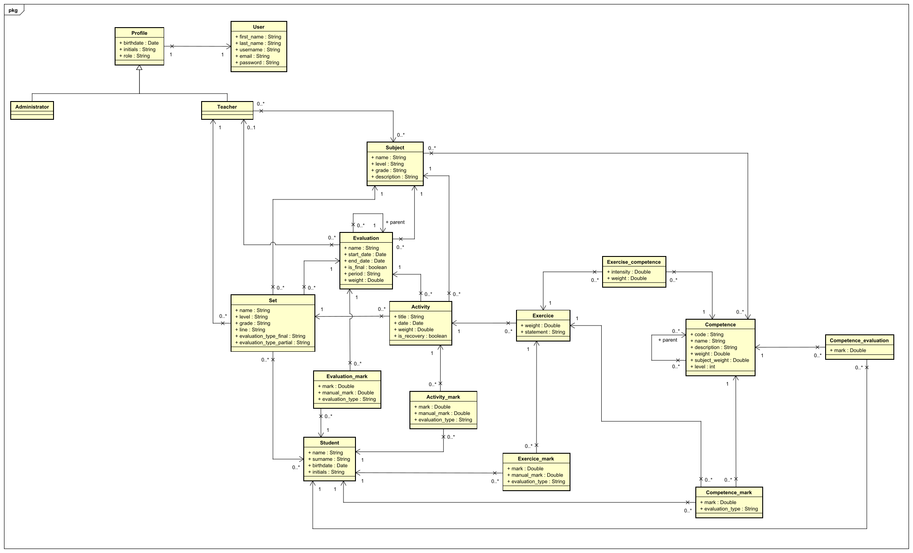

Para gestionar los actores que interactúan con el sistema hemos diseñado una estructura que parte de una clase, es decir, un arquetipo para la creación de datos, llamada _User_ (Usuario) proveniente de xref:Justificaciones de las tecnologías y herramientas utilizadas[Django]. Este objeto recoge nombre, apellidos y datos de registro como el nombre de usuario, el correo electrónico y la contraseña. Para almacenar más datos hemos creado el objeto _Profile_ (Perfil) que servirá como patrón de los objetos que representan los actores del sistema, _Administrator_ (Administrador) y _Teacher_ (Profesor). Lo veremos gráficamente en la siguiente imagen.

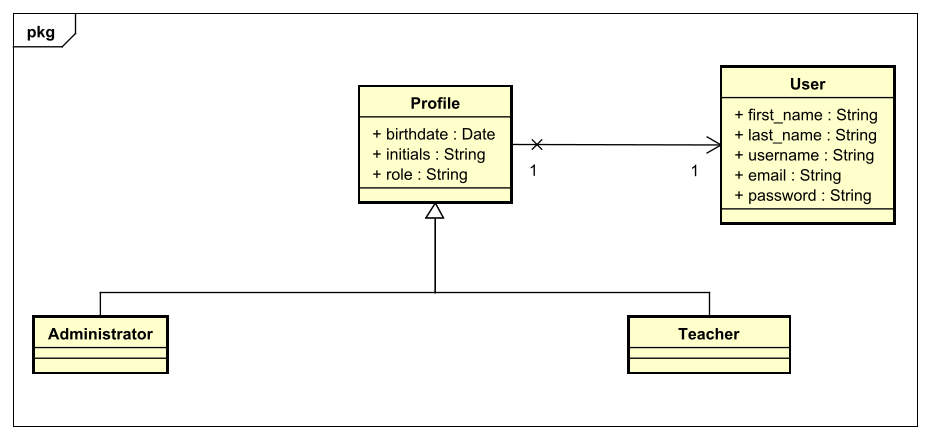

Hemos creado una clase para cada una de las partes que se pueden evaluar. Estas son _Evaluation_ (Evaluación), _Activity_ (Actividad), _Exercise_ (Ejercicio) y _Competence_ (Competencia). Lo veremos mejor en la siguiente imagen.

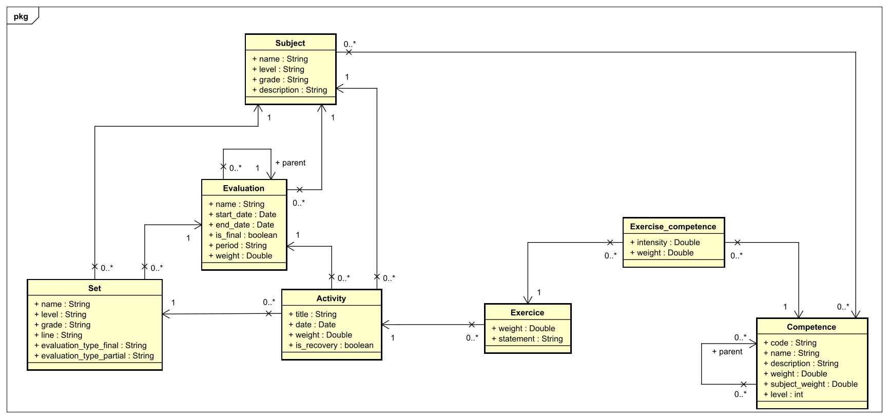

Necesitábamos una clase intermedia entre _Exercise_ (Ejercicio) y _Competence_ (Competencia) que pudiese almacenar una serie de datos que no podrían almacenar en ninguna de las dos, ya que estos no se podrían almacenar en una sola clase. Esta clase es _Exercise_competence_ que, como podemos ver en la siguiente imagen, guarda _intensity_ (intensidad) y _weight_ (peso). La diferencia entre estos conceptos es que la primera marca la "fuerza" con que se debe utilizar la competencia en el ejercicio, y la segunda es la importancia que tiene la competencia en el ejercicio.

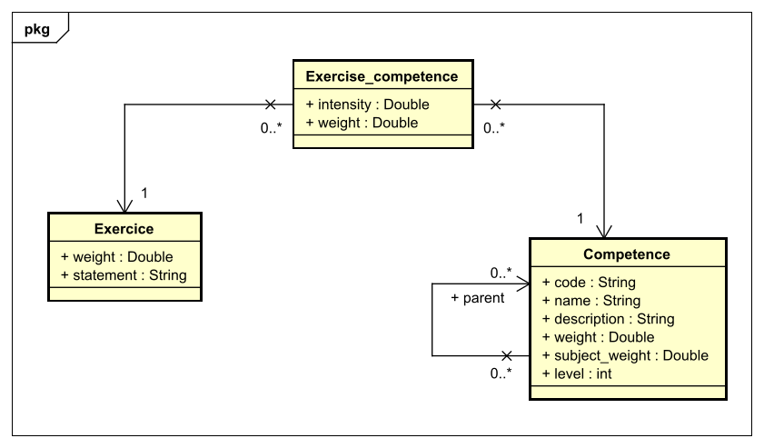

Para almacenar los tres niveles de competencias hemos optado por crear una sola clase que se relacione con sigo misma. Lo veremos más en detalle en la siguiente imagen.

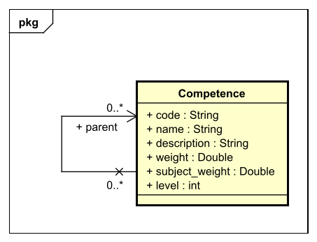

Para almacenar las notas hemos creado una clase para cada una de las clases que se pueden puntuar, es decir, _Evaluation_mark_ para _Evaluation_(Evaluación), _Activity_mark_ para _Activity_ (Actividad), _Exercise_mark_ para _Exercise_ (Ejercicio) y, _Competence_mark_ y _Competence_evaluation_ para _Competence_ (Competencia). La diferencia entre _Competence_mark_ y _Competence_evaluation_ es que la primera clase sirve para almacenar la nota de una competencia dentro de un ejercicio concreto y, la segunda es para la nota total de la competencia. Lo veremos gráficamente en la siguiente imagen.

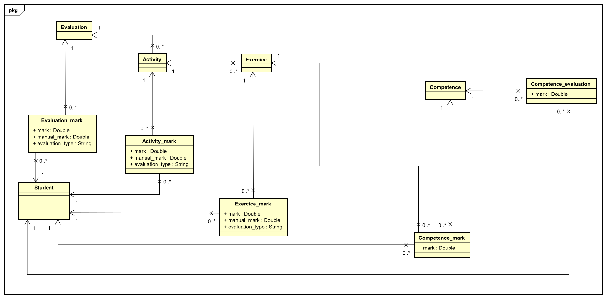

=== III.IV Mockups

En esta sección mostraremos algunos de los mockups creados previamente al desarrollo de la aplicación. El resto de _mockups_ se encuentran disponibles dentro del repositorio de GitHub, en la sección docs/mockups.

También en el directorio de docs podremos encontrar mockups-interactivos, en los que podremos ver de manera interactiva todos los mockups creados.

Dividiremos esta guía en dos partes, administrador y profesor.

==== III.IV.I Administrador

Aquí podremos ver la creación de un alumno:

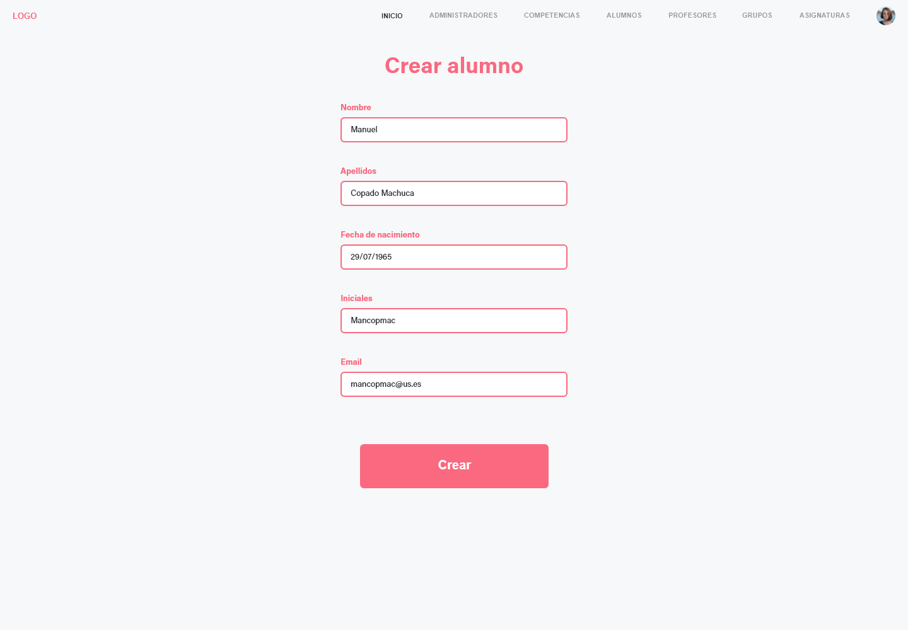

La creación de un grupo:

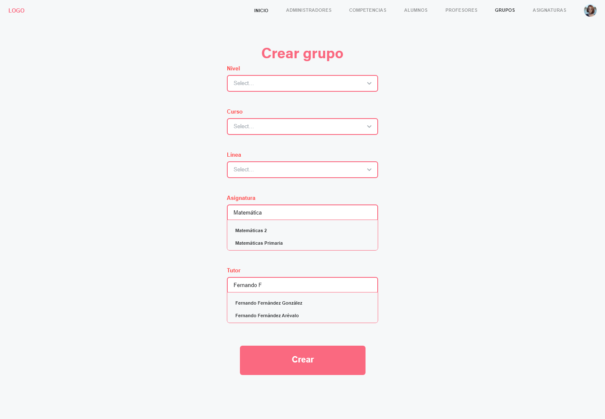

El listado de asignación de unos alumnos a un grupo:

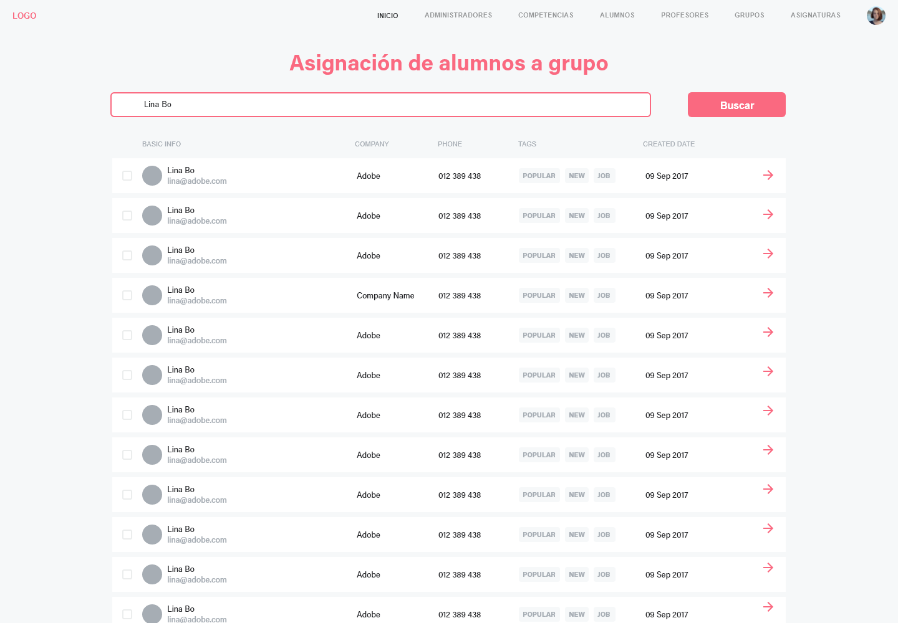

La eliminación de estos de un grupo:

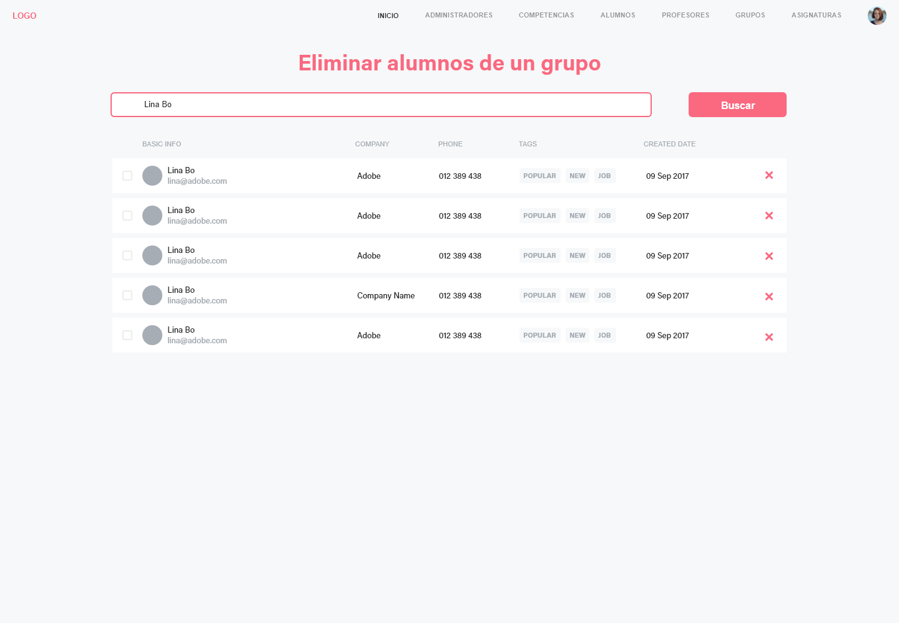

==== III.IV.II Profesor

El listado de alumnos de un grupo al que pertenece:

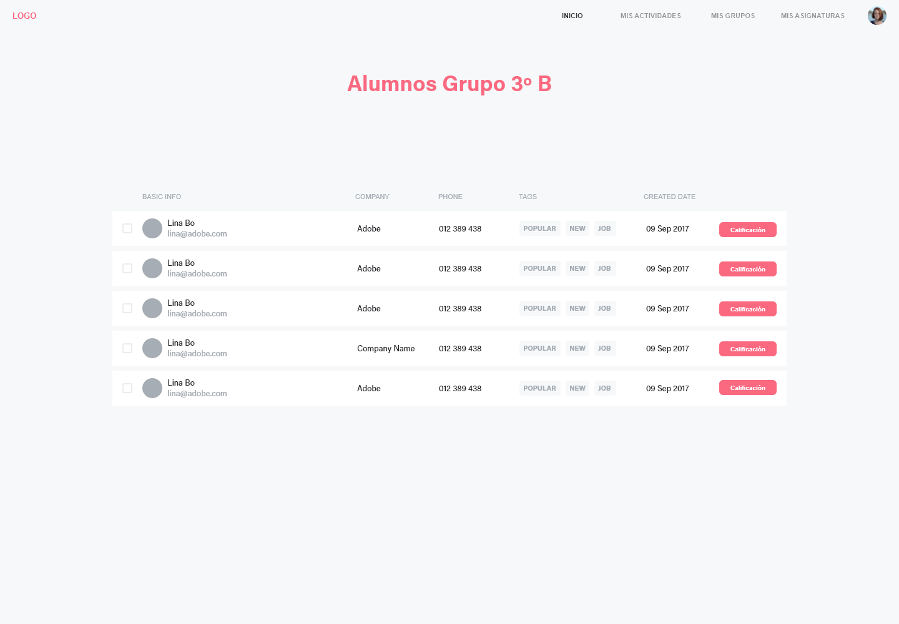

La asignación de una competencia a una asignatura:

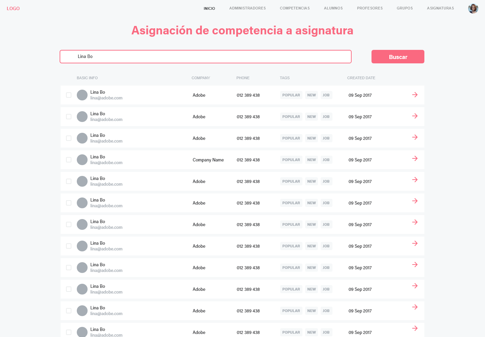

Poder ver las calificaciones de un alumno:

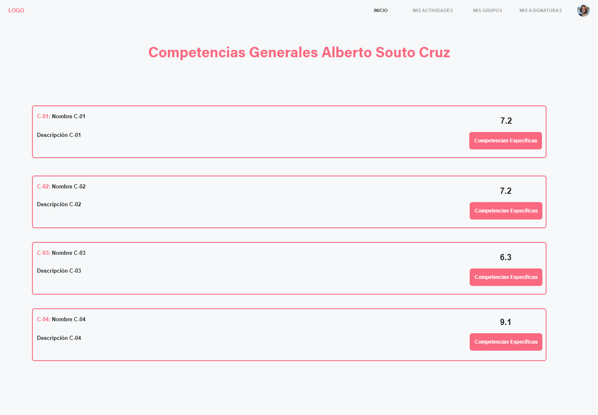 

Poder puntuar las calificaciones mediante competencias:

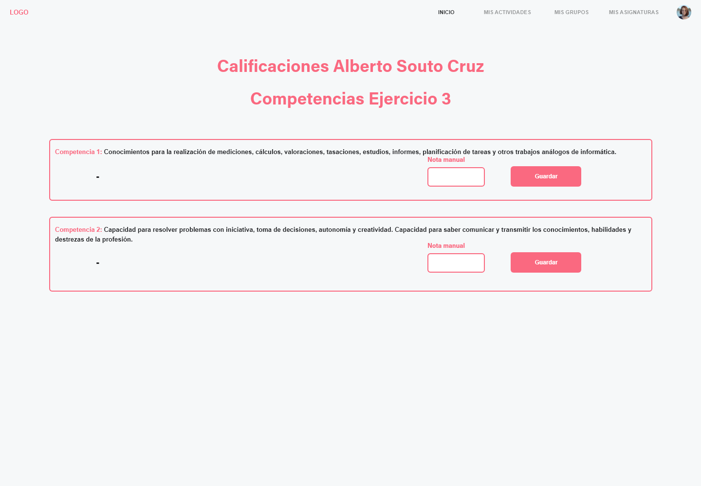 

Modificar un ejercicio:

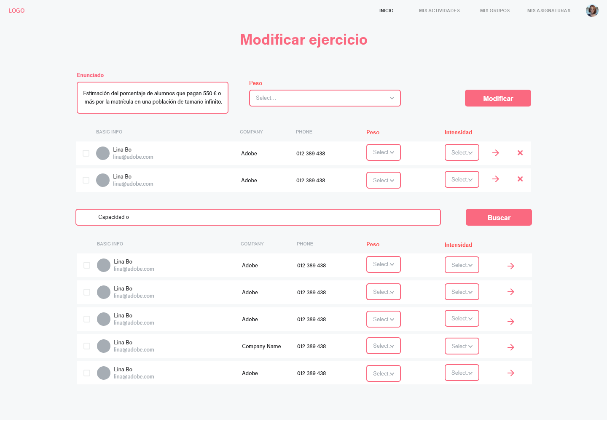 

=== III.V Justificación de las tecnologías y herramientas utilizadas

A la hora de empezar la búsqueda de las tecnologías tuvimos varios factores a tener en cuenta. Uno de ellos era la profesionalidad y otro era la fiabilidad.

En cuanto a la búsqueda del lenguaje de programación a usar, ambos lo tuvimos claro. Sabíamos del potencial de Python para el uso de aplicaciones web. Fue elegido por su madurez algo que más abajo se justifica en detalle.

El resto de las aplicaciones usadas durante el desarrollo fue elegido por que queríamos usar entornos lo más parecidos a la realidad posibles. A causa de esto elegimos Jira, ya que es una aplicación web para la gestión de trabajo, y está especializada en metodologías ágiles, algo que íbamos a usar para el desarrollo.

Este apartado será desglosado en dos: Tecnologías y Herramientas donde hablaremos de manera más específicas de cada una de ellas, y el por qué la elegimos.

==== III.V.I Tecnologías image:./images/icons/tecnologia.png[Icono,17,17]

.Django
[cols="5a"]
|===
|**Django**
|Este es uno de los mejores entornos de trabajo, o xref:Glosario[Framework] de Python muy completo y con una buena documentación. Tenemos experiencia en él, ya que lo hemos utilizado en otras asignaturas, y nos gustaría seguir aprendiendo y adquirir experiencia en Django para nuestro futuro profesional. 
|Alternativas
|Existen otros frameworks de Python como:

* Flask.
* Bottle.
* Pyramid.

Bottle y Flask son _microframework_ mucho más simples que Django y se utilizan para proyectos más sencillos que el nuestro.

Pyramid es una buena opción, mucho más ligero que Django, esto provoca que sea menos completo. Django no necesita otras librerías para el desarrollo de la aplicación, al contrario que Pyramid, que aparte del enrutamiento y la autenticación, necesita librerías externas.

NodeJs es otra buena alternativa. Es un framework que está creciendo continuamente en popularidad con multitud de librerías que lo nutren. Esto también juega en su contra, ya que NodeJs no dispone de una reputación tan sólida, ni unas librerías externas tan bien documentadas como Django. Tampoco dispone de un sistema sólido de seguridad como el que tiene Django, el cual, es muy fácil de implementar. En otro apartado, Django permite una velocidad de desarrollo muy alta, algo de lo que no dispone NodeJs, por lo que la elección de este último extendería más la etapa de desarrollo, y lo haría menos económico.
|===
.Materialize
[cols="5a"]
|===
|**Materialize**
|Materialize es un xref:Glosario[Framework] dispuesto a facilitar el diseño web en todo tipo de escenarios, escritorio o móvil. Habiendo sido recomendada y después de haber pasado por un proceso de selección, su amplia gama de posibilidades y recursos, junto a su facilidad de uso, fue sin duda el detonante de su elección.
|Alternativas
|Existen algunas alternativas como:

* Boostrap
* Foundation

A diferencia de las alternativas, Materialize se basa en la normativa Material design. La creación de esta normativa por parte de Google hace que sea algo con lo que los usuarios están más familiarizados a usar.
Es de esperar que su soporte.
 
Materialize no necesita jQuery para su uso, aunque puedes usarlo si así lo deseas.
 
Otro punto a su favor en comparación con Bootstrap o Foundation es su estética, la cual es muy atractiva,  obteniendo un resultado homogéneo.
 
Uno de los puntos negativos por parte de Bootstrap son los problemas entre versión y versión, ya que cambia la nomenclatura de sus elementos, cosa que con Materialize no ocurre.
 
A diferencia de sus alternativas, Materialize tiene una gran documentación, la cual, es más fácil de entender para alguien que acaba de empezar, así como una amplia cantidad de ejemplos visuales.
 
Gráficamente Materialize está muy por encima de Boostrap o Foundation, debido a su variedad de color y a sus componentes adicionales.
|===

.PostgreSQL
[cols="6a"]
|===
|**PostgreSQL**
|Es una base de datos SQL gratuita diseñada para ambientes de alto volumen. Tenemos experiencia en esta base de datos por varias asignaturas. Además, dispone de una herramienta gráfica muy útil que facilita mucho su utilización.
|Alternativas
|Existen otras alternativas como:

* MySQL
* MariaDB

MySQL es la opción más extendida, pero su licencia puede ser un problema, ya que está sujeta a las decisiones de Oracle. La segunda alternativa es MariaDB, un fork de MySQL de código abierto. La gran diferencia de PostgreSQL con esta última, como hemos comentado anteriormente, es que está pensada para alto volumen. Este ha sido el origen de nuestra elección.    
|===

[cols="6a"]
|===
|**Heroku**
|Es una plataforma en nube gratuita que hemos utilizado anteriormente que está recomendada cuando se usa junto a Django y PostgreSQL.
|Alternativas
|Existen algunas alternativas como:

* AWS
* Firebase

A diferencia de la versión gratuita de Firebase, la cual, es bastante simple, teniendo limitaciones en el espacio de almacenamiento y el número de usuarios simultáneos. Por tanto, para trabajar con ella de manera profesional, deberás pagar, en cambio, Heroku es gratuito para aplicaciones de poco consumo.

Comparándola con Heroku, AWS no es apto para personas principiantes, ya que la complejidad del mismo es bastante elevada.

En comparación con las alternativas expuestas, Heroku permite desplegar versiones, _rollbacks_, gestionar dependencias, como también desarrollar casi con cualquier lenguaje de programación: Java, Ruby, NodeJS…
|===
.Travis
|===
|**Travis**
|Es una herramienta de integración continua que hemos usado en varias asignaturas que nos va a permitir ejecutar nuestros test y comprobar si han surgido fallos al añadir código al repositorio, además vamos a poder conectarlo con SonarCloud.
|Alternativa
|La segunda opción es Jenkins. La mayor ventaja que podemos destacar de Travis frente Jenkins es no que necesita ningún tipo de instalación, solo se configura un solo archivo y se puede utilizar a la perfección.
|===

.Sonarcloud
[cols="6a"]
|===
|**Sonarcloud**
|Nos va a permitir analizar el código de nuestra aplicación de forma automática conectándose a GitHub mediante Travis.
|Alternativas
|Existen algunas alternativas como:

* Codacy
* SonarQube

A diferencia de Sonarcloud Codacy no tiene soporte para Git privado o Azure DevOps git.

SonarQube tienen un mantenimiento de código más costoso, haciendo que sea necesario invertir más tiempo, así como generar "falsos positivos".
|===

.Asciidoc
|===
|**Asciidoc** 
|La forma más habitual de redactar sería en formato Word, pero veíamos necesario que toda la documentación estuviese junto al código. Por eso, elegimos Asciidoc, que nos permite redactar nuestros documentos de forma personalizada con un lenguaje sencillo y fácil de aprender.
|Alternativa
|Como segunda opción tenemos a Markdown, un lenguaje de marcado ligero más extendido que Asciidoc, por lo que hay muchas más herramientas que lo soportan. Al contrario que Asciidoc, carece de un estándar, por lo que al redactar algo con una ligera complejidad, cada herramienta puede interpretarlo de distinta forma.
|===

==== III.V.II Herramientas  image:./images/icons/herramienta.png[Icono,17,17]

.Adobe XD
|===
|**Adobe XD**
|Elegimos Adobe XD por la gran versatilidad en sus apartados para la realización de _mockups_ para el proyecto. Dada a su gran facilidad de uso y sus múltiples plantillas y extensiones, su elección fue en nuestra opinión lo más recomendable. También nos ha permitido hacer _mockups_ interactivos de forma sencilla.

|===

.Visual Studio Code
|===
|**Visual Studio Code**
|Es un editor de código desarrollado por Microsoft y que está siendo muy usado estos últimos años. Nos permite programar en múltiples lenguajes de forma personalizada con las numerosas extensiones que acompañan al editor. Además, implementa una consola de depuración y está vinculado directamente con Git. Lo elegimos, aparte de los puntos anteriores, porque tenemos experiencia en él y es fácil de usar.
|===

.Clockify
|===
|**Clockify**
|Nos permite medir nuestro gasto temporal en nuestras tareas de manera sencilla. Existen muchas herramientas de este tipo, pero esta es la que más hemos utilizado, y nos sirve perfectamente para nuestro trabajo. 
|===

.Github
|===
|**Github**
|Poco que decir en este apartado, GitHub es la plataforma de control de versiones más utilizada. Dado su conocimiento de uso por parte de los miembros del grupo de trabajo, decidimos sin dudarlo su elección.
|===

.Jira
|===
|**Jira**
|Jira es una herramienta de gran utilidad para equipos de todo tipo. Siendo también de gran ayuda para gestión de trabajo en todo tipo de casos, y en especial para el desarrollo _software_.
Con todo esto y con el conocimiento de que se usa en entornos laborales de grandes empresas como Everis, decidimos utilizarla y aprender cómo funciona.
|===

=== III.VI Gestión de código

Este apartado es una parte crucial a la hora de trabajar en grupo con un _software_. En nuestro caso hemos usado Git, el cual es una gran herramienta que se basa en la creación de ramas para el trabajo en paralelo. 

Algo muy importante a la hora de trabajar con Git es llevar una metodología, nosotros hemos usado la más conocida por parte de ambos: GitFlow. Esto ha dado lugar a una mejora del desarrollo continuo de las prácticas.

Dividiremos este apartado en tres con el fin de desglosar de manera más detallada los mismos: Gestión de ramas, Gestión de commits y Pull requests
 
==== III.VI.I Gestión de ramas

Una rama es un espacio de trabajo paralelo que deriva de una versión común. Hemos sido muy estrictos en este apartado, en el cual hemos seguido las siguientes pautas.

Tenemos dos Ramas por defecto:

* master
* dev

En la rama **dev** se incluirán todas las ramas de desarrollo con *pull requests*. La rama **master** solo se podrán añadir desde la rama **dev**, para incluir la release. 

El resto de las ramas seguirán el siguiente esquema: 

*<codigo_rama>/<codigo_sprint>/<nombre_tarea>*

Códigos de rama (<codigo_rama>):

* feat/     (nueva feature)
* fix/      (bug fix)
* hotfix/   (bug fixes en producción)
* refactor/ (refactorización de código)
* docs/     (cambios de documentación)
* test/     (añadir o refactorizar tests)
* release/  (nueva release)

Códigos de sprint (<codigo_sprint>):

* s0            (previo al comienzo del desarrollo de código)
* s1/s2/s3/s4   (sprints 1, 2, 3, 4 respectivamente)
* d             (tras la finalización del desarrollo, realización de memoria)

Nombre de las tareas (<nombre_tarea>): Nombre especificado en Jira, o abreviación. Por ejemplo, CU-07 Edición de profesores, o simplemente, CU-07. Se pueden añadir varias tareas separadas por &.

==== III.VI.II Gestión de commits

El comando git commit se basa en guardar todos los cambios realizados en local junto a una breve descripción del usuario con el fin de dar sentido al trabajo realizado.

Los commits deben seguir el siguiente patrón: *[<tipo_commit>] <nombre_commit>*. Además, se puede añadir una descripción opcionalmente.

Tipo de commit (<tipo_commit>):

* feat      (nueva feature)
* fix       (bug fix)
* refactor  (refactorización de código)
* doc       (cambios de documentación)
* test      (añadir o refactorizar tests)
* release   (nueva release)

==== III.VI.III Pull requests

Para añadir funcionalidad a la rama *dev* se abrirá una pull request. Esto se basa en hacer una petición de la tarea realizada, con el fin de añadirla a el proyecto. El que haya desarrollado la funcionalidad se asignará a la pull request y asignará al compañero como revisor. Para que la pull request se cómo válida debe de pasar el control y análisis de Travis y Sonarcloud, además del visto bueno del revisor. 

Una vez que se haya hecho merge a dev, la rama se eliminará.

=== III.VII Gestión de versiones

En este apartado detallaremos como hemos nombrado a las versiones relacionadas a cada uno de los incrementos de funcionalidad. La especificación de la versión está marcada por el siguiente patrón: **X.Y.Z**, donde:

* **X**: Versión mayor.
* **Y**: Versión menor.
* **Z**: Versión en el que se solventan _bugs_ de la versión anterior.

Las versiones existentes son las siguientes:

* **0.1**: Versión que incorpora todo el sprint 1. Incluye la primera parte de la funcionalidad del administrador, así como el modelo de datos y el primer _populate_.
* **0.2**: Versión que incorpora todo el sprint 2. Incluye más funcionalidad del administrador.
* **0.2.1**: Corrección de algunos errores de la version **0.2**.
* **0.3**: Versión que incorpora todo el sprint 3. Incluye la mayor parte de la funcionalidad del profesor.
* **0.4**: Versión que incorpora todo el sprint 4. Incluye el resto de funcionalidad.

=== III.VIII Fuentes e Imágenes

El apartado visual dentro de una aplicación web se le conoce como el _frontend_.Este tiene muchos factores, el color, la forma, las imágenes, etc. En nuestro caso le pusimos mucho hincapié a todo esto, pero especialmente al apartado de las imágenes y la fuente. 

Para ambas cosas nos pusimos a estudiar, ya que este apartado tiene temas de derechos, algo que es un poco controvertido. Estuvimos buscando algo que se adaptara lo mejor posible a nuestra web, algo cotidiano y sencillo. Nuestra finalidad era que una persona que no tuviese ningún conocimiento sobre la informática considerase nuestra web acogedora y visualmente atractiva.

A continuación, hablaremos de la fuente escogida y de dónde hemos seleccionado las imágenes mostradas en la aplicación.

==== III.VIII.I Fuente 
La opción a la hora de seleccionar una fuente ha sido elegida con el fin de evitarnos problemas jurídicos, así como poderla usar en aplicaciones de fines lucrativos.

Este fué uno de los factores más importantes de cara a la elección de una fuente. Otro de ellos fué la elección de una fuente que se use habitualmente y que nos fuera de fácil acceso y visualmente atractiva.

===== III.VIII.I.I Elección

Nos decantamos por la Fuente Ubuntu, la cual obtuvimos del siguiente link:

https://design.ubuntu.com/font/

La licencia de esta fuente es _copyleft_ permite que las tipografías sean «usadas, estudiadas, modificadas y redistribuidas libremente» cumpliendo los términos estipulados en ella.

La documentación de la licencia se encuentra en la carpeta _fonts_, cuyo nombre es "LICENSE.txt".

==== III.VIII.II Imágenes

Esta tarea sin duda fue una de las más difíciles de encontrar, puesto que todos los bancos de imágenes tenían derechos de autor y muchas trabas legales para su uso.

La opción a la hora de seleccionar las imágenes para la web fue difícil, ya que buscábamos un banco de imágenes que nos permitiera el uso comercial pensando en un hipotético uso de la misma y sin derechos de autor.

===== III.VIII.II.I Elección

Nos decantamos por la web https://unsplash.com/, la cual tiene un gran número de imágenes muy útiles, y una licencia que nos permitía lo nombrado anteriormente.

Con respecto a la licencia, dice lo siguiente:

_Unsplash photos are made to be used freely. Our license reflects that._

* _All photos can be downloaded and used for free._
* _Commercial and non-commercial purposes._
* _No permission needed (though attribution is appreciated!)._

_What is not permitted 👎_

* _Photos cannot be sold without significant modification._
* _Compiling photos from Unsplash to replicate a similar or competing service._

Para más información puede consultar dicha licencia en el siguiente enlace:
https://unsplash.com/license

=== III.IX Implementación del cálculo

Existen muchas formas de realizar el cálculo de las notas, y dado que no podemos implementarlas todas, se desarrollará de tal forma que sea posible añadir nueva funcionalidad para el cálculo. Para que el profesor pueda modificar cómo se va a realizar el cálculo, se ha decidido almacenar esa información en el grupo, así todos los alumnos tendrán el mismo método y no supone un coste computacional muy alto. Se ha separado la selección del método del cálculo, pudiéndose elegir un método de cálculo para la evaluación final y otro para las evaluaciones parciales, para que sea más flexible.

Todos los cálculos que se realizan en el proyecto están normalizados, por lo que los pesos son bastantes flexibles y no están limitados de 0 a 10 o de 0 a 1, sino que están limitados de 0 a 999,99. Hemos pensado que el número es lo suficientemente grande para que no sea un impedimento en su uso.

Para mejorar el rendimiento todo lo posible, cuando se puntúa manualmente algún apartado, siempre se calcula "hacia arriba", es decir, que si puntúas una competencia se calculará la nota total de la competencia y la nota del ejercicio, después la nota de la actividad y por último la nota de las evaluaciones, primero las parciales y luego la final. Además, si se puntúa manualmente un ejercicio no se calculará las competencias, pero si la actividad y las evaluaciones.

Los métodos de cálculo implementados son los siguientes:

* Evaluaciones finales:

** Por competencias: Media ponderada de las competencias de nivel dos.
** Por evaluaciones (Sin recuperación): Media ponderada de las evaluaciones parciales.
** Por evaluaciones (Con recuperación): Si hay recuperaciones, la media ponderada de estas, sino media ponderada de las evaluaciones parciales. 

* Evaluaciones parciales:

** Por todas las actividades: Media ponderada de todas las actividades asociadas a la evaluación.
** Por recuperaciones: Si hay recuperaciones, la media ponderada de estas, sino media ponderada de todas las actividades asociadas a la evaluación.

Al cambiar el método de cálculo de un grupo de clase, se necesita recalcular las evaluaciones de todos los alumnos de esa clase, por lo que necesariamente es el apartado con menor rendimiento.

Para mejorar la experiencia de usuario en la puntuación se ha optado por añadir una funcionalidad que permita puntuar cada una de las partes en la propia tabla. Esto es un progreso respecto a nuestra primera idea. Esta era que al usuario se le presentase una pantalla para que pudiera introducir la nota. Al tener que hacer click en demasiadas ocasiones esta funcionalidad se volvía un poco engorrosa.

Además, se ha añadido otro par de funcionalidades que mejoran la experiencia de usuario. La primera consiste en poder pasar entre la pantalla de un ejercicio concreto de un alumno al siguiente. Esto permite al profesor puntuar un ejercicio en todos los alumnos sin tener que volver a la página donde se lista los alumnos de un grupo de clase. La otra funcionalidad es pasar por ejemplo, de un ejercicio a otro de un alumno o pasar de una actividad a la siguiente.

==== III.IX.I Añadir nuevos métodos de cálculo

Los pasos son los siguiente:

* En primer lugar, añadir en _forms.py_ el valor del método en base de datos y cómo se va a mostrar al usuario. Se deberá modificar _CHOICES_EVALUATION_TYPE_FINAL_EN_ y _CHOICES_EVALUATION_TYPE_FINAL_ para las evaluaciones finales y/o _CHOICES_EVALUATION_TYPE_PARTIAL_EN_ y _CHOICES_EVALUATION_TYPE_PARTIAL_ para las parciales. En la siguiente imagen podemos ver la parte del código que se debe modificar.

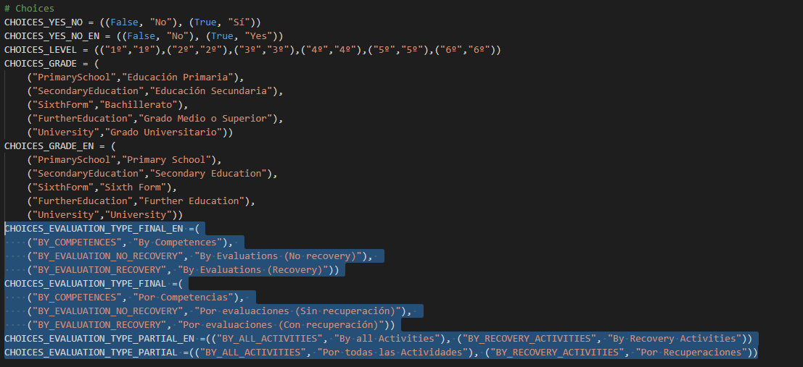

* En segundo lugar, implementar el nuevo método de cálculo en _services.py_ en la clase _MarkService()_.

* En último lugar, modificar el método _calculate_evaluation_mark_ de la clase _MarkService()_ dentro de _services.py_ para añadir en el condicional el nuevo método. Podemos verlo en la siguiente imagen.

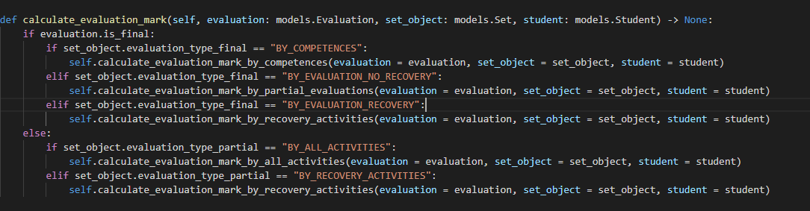

=== III.X Adaptabilidad del diseño en diferentes resoluciones

La resolución nativa de la aplicación es _1920x1080_, dado que es la resolución en la que se ha desarrollado la aplicación. La visualización de la aplicación en resoluciones de escritorio son correctas, pero las resoluciones de dispositivos móviles han sido las más complicadas de realizar. El único dispositivo móvil en el que hemos trabajado en su adaptabilidad, es decir en su xref:Glosario[diseño responsive], es el **iPhone X** porque es de los dispositivos más grandes, por lo tanto, el más fácil de implementar.

El tratamiento de los formularios en pantallas más pequeñas no ha sido complicado dado que xref:Justificaciones de las tecnologías y herramientas utilizadas[Materialize] nos daba las herramientas necesarias para hacerlo. El problema ha recaído en las listas, dado que hay mucha información repartida horizontalmente, por lo que hemos tenido que omitir información. En casi todas las listas se ha agrupado los botones con un cuadro emergente, es decir, un xref:Glosario[modal], para aprovechar la mayor cantidad de espacio posible. Esto ha permitido que no se pierda funcionalidad.

En el resto de resoluciones móviles tampoco se pierde funcionalidad, pero cuanto menor es la pantalla peor se va a ver.

=== III.XI Traducción

Para la traducción hemos utilizado **gettext** y la etiqueta de Django _trans_, los cuales nos permite traducir elementos concretos de las vistas y obtener información del idioma actual de la aplicación.

Para internacionalizar las vistas utilizamos las etiquetas _trans_ sobre la palabra o conjunto de palabras que queremos traducir. Podemos ver un ejemplo en el siguiente bloque de código.

.Ejemplo de etiqueta de traducción
[source, html]
----
<h6 class="centered">
    : {{set_object.name}}
</h6>  
----

Después debemos tener un archivo de configuración de cada idioma al que queramos traducir. En la siguiente imagen se muestra como se debe ordenar los archivos.

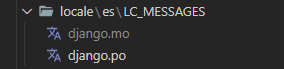

Para crear dicho archivo y compilarlo debemos utilizar los siguientes comandos:

.Comando de creación de archivo de configuración
[source, cmd]
----
django-admin makemessages -l es
----

.Comando de compilación
[source, cmd]
----
py manage.py compilemessages 
----

cambiando _es_ (español) por el idioma correspondiente.

Sin embargo, para traducir los errores de formulario no es posible utilizar estas etiquetas, porque hemos implementado un método, que podemos ver en la bloque de código, valiéndose del método de *gettext* llamado _get_language_, que hace saltar los errores de formulario en el idioma correcto.

.Método de error de validación
[source, python]
----
def raise_error(self, en_message: str, es_message: str):
        
    if get_language() == 'en':
        raise ValidationError(
            en_message)
    else:
        raise ValidationError(
            es_message)
----