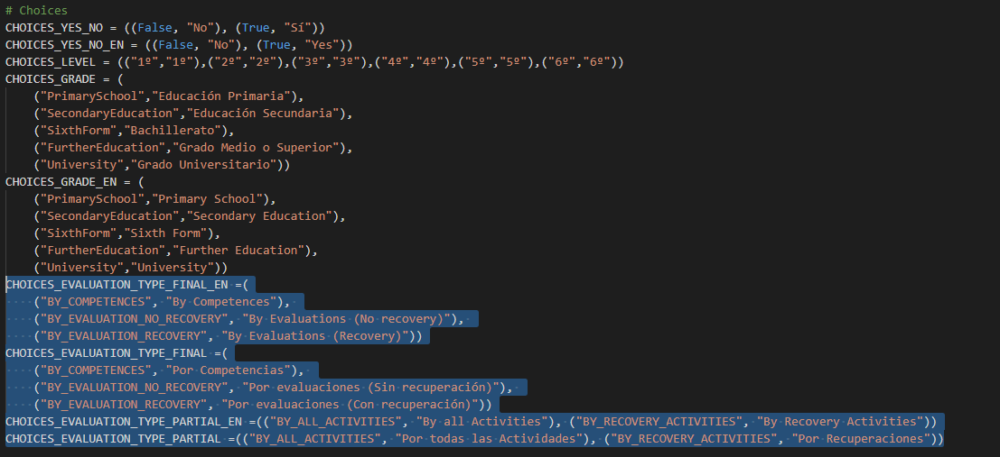

Existen muchas formas de realizar el cálculo de las notas, y dado que no podemos implemetarlos todos, se desarrollará de tal forma que sea posible añadir nueva funcionalidad para el cálculo. Para que el profesor pueda modificar como se va a realizar el cálculo, se ha decidido almacenar esa información en el grupo, así todos los alumnos tendrán el mismo método y no supone un coste computacional muy alto. Se ha separado la selección del método del cálculo, pudiéndose elegir un método de cálculo para la evalaución final y otro para las evaluaciones parciales, para que sea más flexible.

Todos los cálculos que se realizan en el proyecto están normalizados, por lo que los pesos son bastantes flexibles y no estám limitados de 0 a 10 o de 0 a 1, sino que están limitados de 0 a 999,99. Hemos pensado que el número es lo suficinete grande para que no sea un impedimento en su uso.

Para mejorar el redimiento todo lo posible, cuando se puntúa manualmente algún apartado, siempre se calcula "hacia arriba", es decir, que si puntúas una competencia se calculará la nota total de la competencia y la nota del ejercicio, después la nota de la actividad y por último la nota de las evaluaciones, primero las parciales y luego la final. Además, si se puntúa manualmente un ejercicio no se calculará las competencias, pero si la actividad y las evaluaciones.

Los métodos de cálculo implementados son los siguientes:

* Evaluaciones finales:

** Por competencias: Media ponderada de las competencias de nivel dos.
** Por evaluaciones (Sin recuperación): Media ponderada de las evaluaciones parciales.
** Por evaluaciones (Con recuperación): Si hay recuperaciones, la media poderada de estas, sino media ponderada de las evaluaciones parciales . 

* Evaluciones parciales:

** Por todas las actividades: Media ponderada de todas las actividades asociadas a la evaluación.
** Por recuperaciones: Si hay recuperaciones, la media poderada de estas, sino media ponderada de todas las actividades asociadas a la evaluación.

Al cambiar el método de cálculo de un grupo de clase, se necesita recalcular las evaluaciones de todos los alumnos de esa clase, por lo que necesariamente es el apartado con menor rendimiento.

Para mejorar la experiencia de usuario en la puntuación se ha optado por añadir una funcionalidad que permita puntuar cada una de la partes en la propia tabla. Esto es un progreso respecto a nuestra primera idea. Esta era que al usuario se le presentase una pantalla para que pudiera introducir la nota. Al tener que hacer click en demasiadas ocasiones esta funcionalidad se volvía un poco engorrosa.

Además se ha añadido otro par de funcionalidades que mejorar la experiencia de usuario. La primera consiste en poder pasar entre la pantalla de un ejercico concreto de un alumno al siguiente. Esto permite al profesor puntuar un ejercicio en todos los alumnos sin tener que volver a la página donde se lista los alumnos de un grupo de clase. La otra funcionalidad es pasar, por ejemplo de un ejercicio a otro de un alumno o pasar de una actividad a la siguiente.

==== Añadir nuevos métodos de cálculo

Los pasos son los siguiente:

* En primer luagar, añadir en _forms.py_ el valor del método en base de datos y como se va a mostrar al usuario. Se deberá modificar _CHOICES_EVALUATION_TYPE_FINAL_EN_ y _CHOICES_EVALUATION_TYPE_FINAL_ para las evaluaciones finales y/o _CHOICES_EVALUATION_TYPE_PARTIAL_EN_ y _CHOICES_EVALUATION_TYPE_PARTIAL_ para las parciales.

* En segundo lugar, implementar el nuevo método de cálculo en _services.py_ en las clase _MarkService()_.

* En último lugar, modificar el método _calculate_evaluation_mark_ de las clase _MarkService()_ dentro de _services.py_ para ñadir en el condicional el nuevo método.

image::images/calculate_evalution_mark.PNG[]