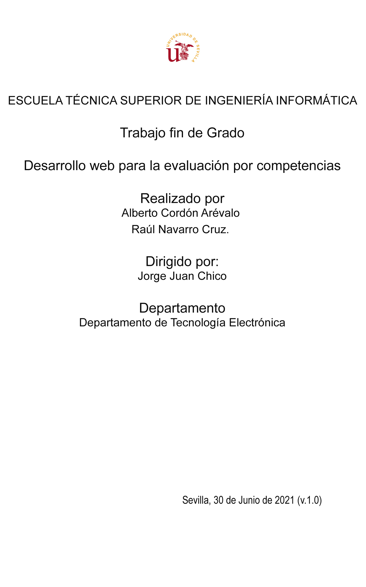

:doctype: book
:source-highlighter: coderay
:front-cover-image: 

:toc:
:toc-title: Índice general
:table-caption: Tabla

== Resumen

include::Resumen.adoc[]

== I. Introducción

include::Introducción.adoc[]

=== Definición de objetivos

include::DefiniciónDeObjetivos.adoc[]

=== Análisis de antecedentes y aportación realizada

include::AntecedentesYAportaciónRealizada.adoc[]

===  Comparativas con otras alternativas

include::ComparativasConOtrasAlternativas.adoc[]

== II. Análisis temporal y de costes de desarrollo

include::AnálisisTemporalYDeCostesDeDesarrollo.adoc[]

=== Planificación

include::Planificación.adoc[]

=== Retrasos e incidencias

include::RetrasosEIncidencias.adoc[]

=== Reuniones

include::Reuniones.adoc[]

=== Costes

include::Costes.adoc[]

== III. Análisis de requisitos, diseño e implementación

include::IntroduccionAnalisisDeRequisitos.adoc[]

=== Requisitos

include::RequisitosDeInformación.adoc[]

include::RequisitosFuncionales.adoc[]

include::RequisitosNoFuncionales.adoc[]

=== Casos de uso

include::CasosDeUso.adoc[]

=== Modelo de datos

include::ModeloDeDatos.adoc[]

=== Mockups

include::Mockups.adoc[]

=== Justificaciones de las tecnologías y herramientas utilizadas

include::Justificaciones.adoc[]

=== Gestión de código

include::GestiónDeCódigo.adoc[]

=== Gestión de versiones

include::GestiónDeVersiones.adoc[]

=== Fuentes e Imágenes

include::FuenteEImágenes.adoc[]

=== Implementación del cálculo

include::Cálculo.adoc[]

=== Adaptabilidad del diseño en diferentes resoluciones

include::AdaptabilidadDelDiseño.adoc[]

=== Traducción

include::Traducción.adoc[]

== IV. Pruebas

include::Pruebas.adoc[]

== V. Conclusiones y desarrollos futuros

include::ConclusionesYDesarrollosFuturos.adoc[]

== Glosario

include::Glosario.adoc[]

== Bibliografía

include::Bibliografía.adoc[]

== Apéndices

===  Manual de usuario

include::ManualDeUsuario.adoc[]

=== Instalación

include::Instalación.adoc[]