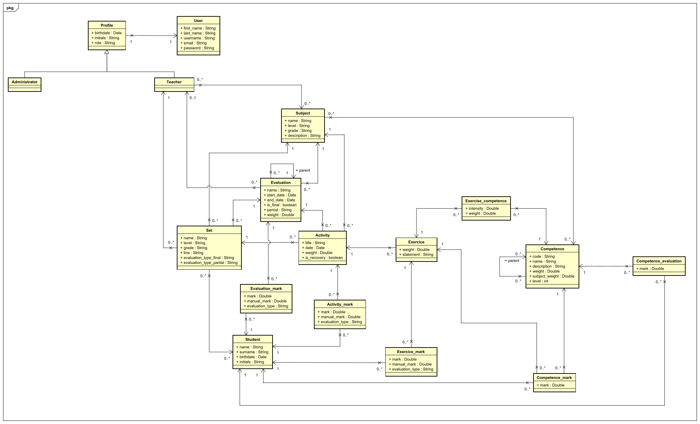
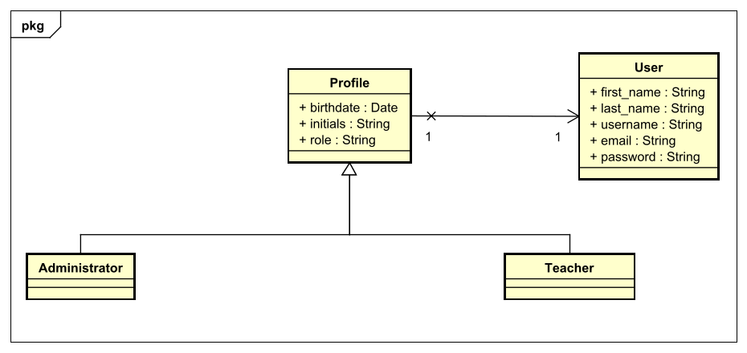
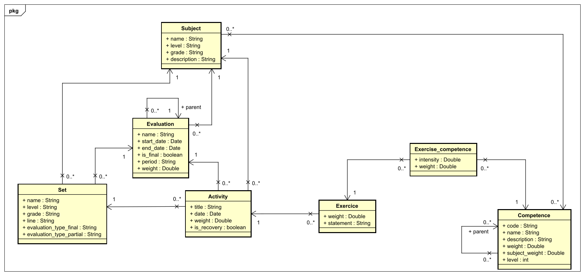
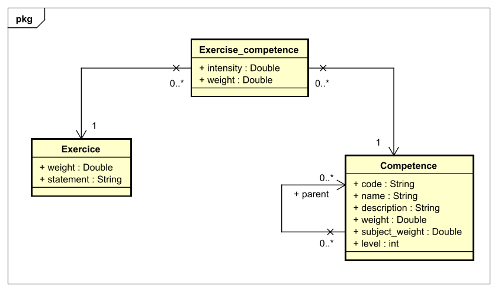
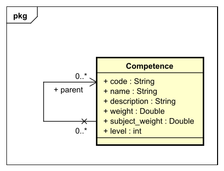
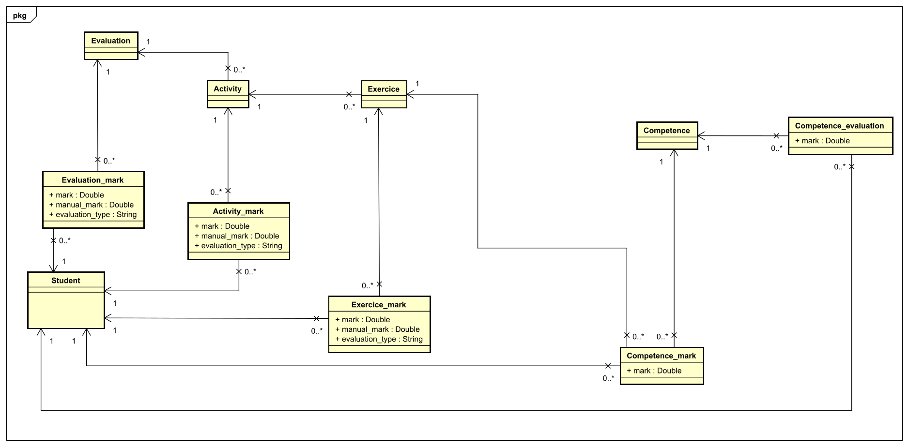

Sabemos que un parte muy importante del desarrollo de una aplicación web es el modelado de los datos. Este no es más que una estructura que nos permite visualizar, especificar y documentar que datos se van a guardar y como. Además sirve de punto de apoyo para construir la aplicación. Algo que es crucial, se asemeja a los que serían los cimientos de una casa. Por ello hemos realizado una gran implicación y dedicación al modelo con el fin de que se pudiera construir toda la funcionalidad alrededor de este.

Al largo del apartado iremos mostrando partes del modelo que nos resultan interesantes mediante el uso de diagramas. En primer lugar veremos la totalidad del modelo en la siguiente imagen.

Para gestionar los actores que interactúan con el sistema hemos diseñado de una estructura que parte de una clase, es decir, un arquetipo para la creación de datos, llamada _User_ (Usuario) proveniente de xref:Justificaciones de las tecnologías y herramientas utilizadas[Django]. Este objeto recoge nombre, apellidos y datos de registro como el nombre de usuario, el correo electrónico y la contraseña. Para almacenar más datos hemos creado el objeto _Profile_ (Perfil) que servirá como patrón de los objetos que representan los actores del sistema, _Administrator_ (Administrador) y _Teacher_ (Profesor). Lo veremos gráficamente en la siguiente imagen.

Hemos creado un clase para cada una de las partes que se pueden evaluar. Estas son _Evaluation_(Evaluación), _Activity_ (Actividad), _Exercise_ (Ejercicio) y _Competence_ (Competencia). Lo veremos mejor en la siguiente imagen.

Necesitábamos una clase intermedia entre _Exercise_ (Ejercicio) y _Competence_ (Competencia) que pudiese almacenar una serie de datos que no podrían almacenar en ninguna de las dos, ya que estos no se podrían almacenar en una sola clase. Esta clase es _Exercise_competence_ que, como podemos ver en la siguiente imagen, guarda _intensity_ (intensidad) y _weight_ (peso). La diferencia entre estos conceptos es que el primero marca la "fuerza" con que se debe utilizar la competencia en el ejercicio, y la segunda es la importancia que tiene la competencia en el ejercicio.

Para almacenar los tres niveles de competencias hemos optado por crear una sola clase que se relacione con sigo misma. Lo veremos más en detalle en la siguiente imagen.

Para almacenar las notas hemos creado una clase para cada una de las clases que se pueden puntuar, es decir, _Evaluation_mark_ para _Evaluation_(Evaluación), _Activity_mark_ para _Activity_ (Actividad), _Exercise_mark_ para _Exercise_ (Ejercicio) y, _Competence_mark_ y _Competence_evaluation_ para _Competence_ (Competencia). La diferencia entre _Competence_mark_ y _Competence_evaluation_ es que la primera clase sirve para almacenar la nota de una competencia dentro de un ejercicio concreto y, la segunda es para la nota total de la competencia. Lo veremos gráficamente en la siguiente imagen.

