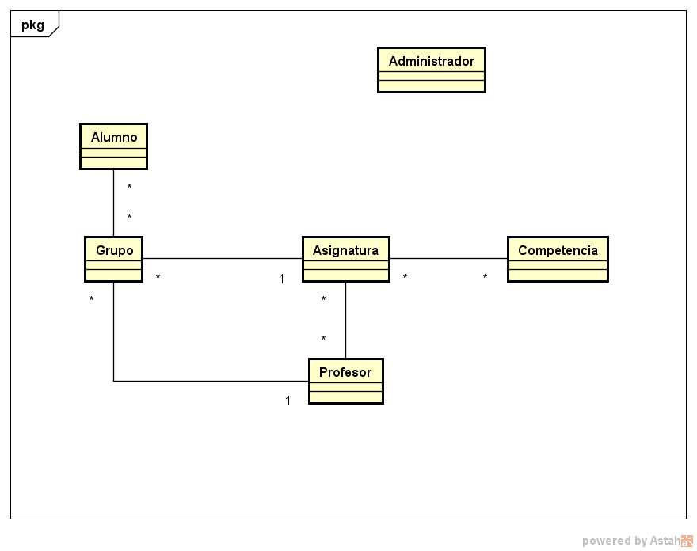
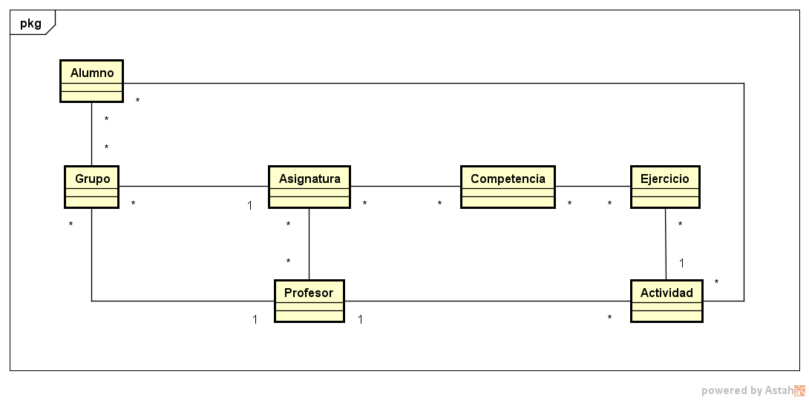

== Especificaciones
Un *administrador* debe ser capaz de:

* Listar, crear, modificar y eliminar alumnos.
* Listar, crear, modificar y eliminar profesores.
* Listar, crear, modificar y eliminar grupos de clase.
* Asignar alumnos a sus respectivos grupos de clase.
* Asignar profesores a un grupo de clase.
* Listar, crear, modificar y eliminar asignaturas.
* Asignar una asignatura a grupos de clase.
* Asignar asignatura a profesores.
* Listar, crear, modificar y eliminar competencias.
* Asignar competencias a una asignatura.
* Listar, crear y eliminar nuevos administradores.
* Modificar sus datos de usuario.
 
[#img-admin] 
.Diagrama de Administrador 

◙

Un *profesor* debe ser capaz de:

* Listar sus grupos de clase.
* Listar sus asignaturas.
* Listar las competencias de una asignatura.
* Listar sus alumnos.
* Listar, crear, modificar y eliminar actividades.
* Crear, modificar y eliminar ejercicios. 
* Asignar competencias a un ejercicio.
* Asignar una intensidad a una competencia.
* Asignar ejercicios a una actividad.
* Ponderar una competencia en un ejercicio.
* Puntuar las competencias de un ejercicio.
* Puntuar un ejercicio.
* Puntuar una actividad.

[#img-profesor] 
.Diagrama de Profesor 

